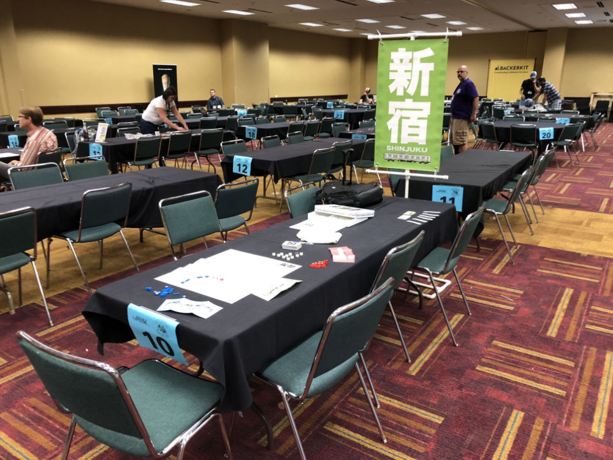
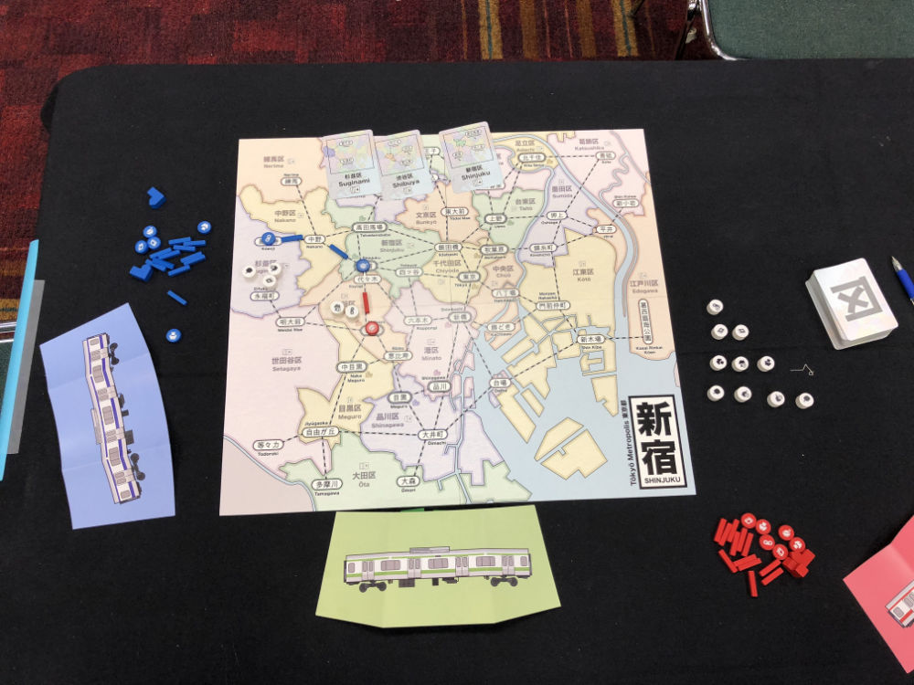
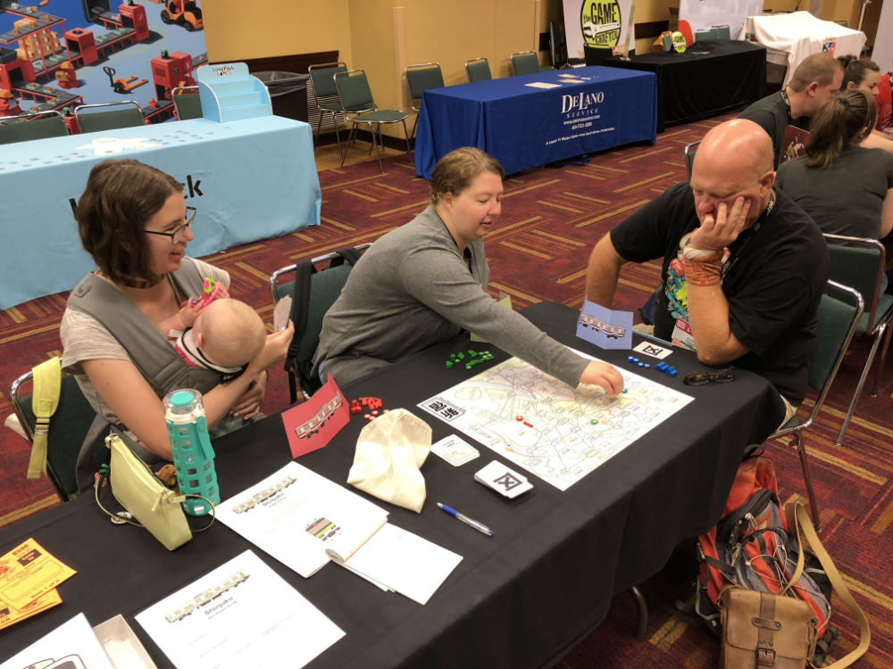
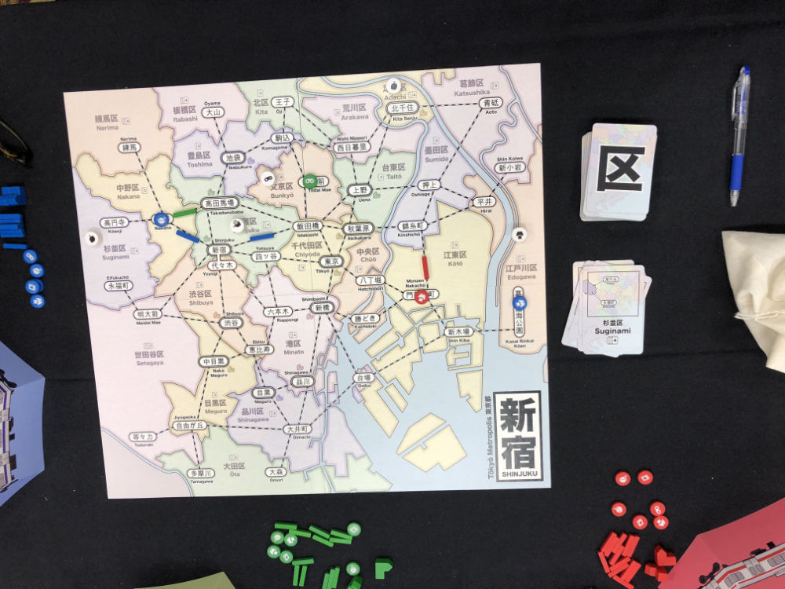
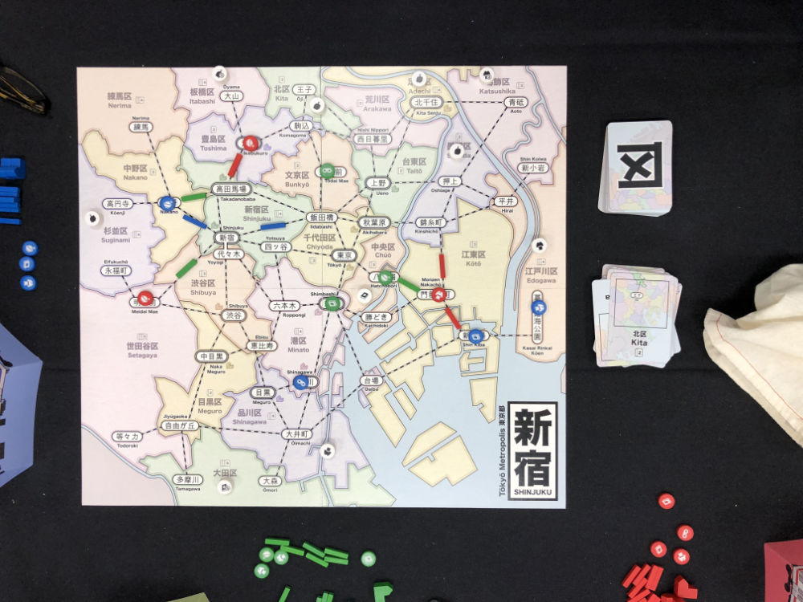
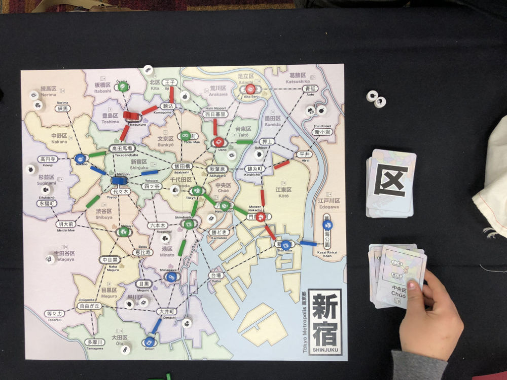
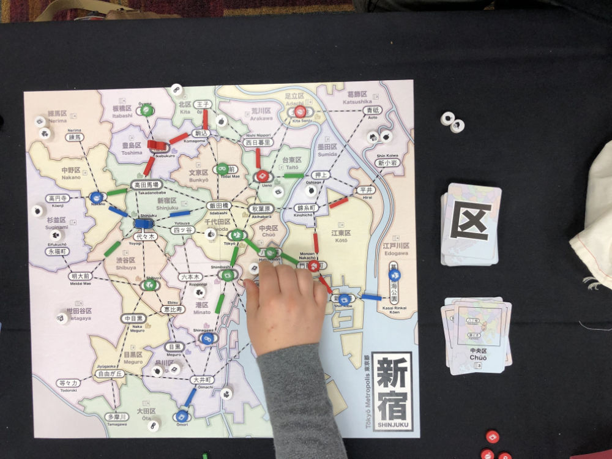
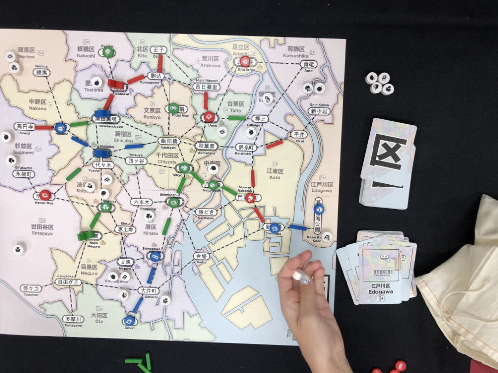
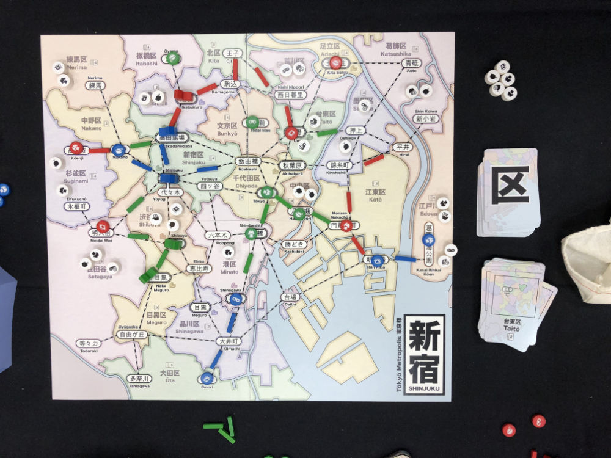

# Playtest #41 - GenCon

Sun 4 Aug 2019 - 8am

Participants: Sarah G, Krystal U, Jim P

         

## Comments

Noted that first move is commonly Build + Expand

Rule clarifications:

* Matching customer to upgrade to a dept store must be one that was earned previously. It doesn't come from the board.
* "Can we look through the discard pile?" No, and note that we'll be going through the deck multiple times.
* "Can start move in empty station (without store)?" Yes
* "Can you refuse to take a customer?" No (see scoring discussion below)

Having 0 cards for the last round doesn't feel good.

"I wasn't sure I would like this game when I sat down, but I want to play again."

"Looks like Ticket to Ride, but doesn't play like it"

Update cards: The map has been updated to have double lines around dept store locations (in addition to the icon), but the cards have not.

Timestamps:

* 8:10 Begin rules explanation
* 8:26 Start game
* 8:56 1st dept store
* 8:57 2nd dept store
* 9:04 3rd dept store
* 9:05 4th dept store
* 9:11 5th dept store
* 9:24 End

Scores (single/double = total):

|         |    |    |    |    | Score |
| ------- | --- | --- | --- | --- | --- |
| Sarah   | 0/1 = 2 |~2/0 = 2~| 1/1 = 3 | 1/0 = 1   |  6 |
| Krystal | 0/2 = 4 |~2/0 = 2~| 1/0 = 1 | 1/1 = 3   |  8 |
| Jim     | 1/2 = 5 | 1/2 = 5 |~3/2 = 7~| 1/0 = 1   | 11 |

Scoring mini puzzle:

* On Krystal's last turn, she had the opportunity to acquire more customers with her Move action, but chose not to (she ended her Move early).
* She could have gained an additional Food customer
* Doing so would have caused her to have more Food tokens than any other type.
* Avoiding this Food customer resulted in her having a 3-way tie between Food, Clothing and Electonics for the most tokens, which allowed her to choose the one with the fewest points.
* Note that another player could have noticed that she avoided taking this Food customer and given her one on their Move action.

## Suggestions/Actions

For next playtest:

* When last customer is drawn, that player finishes their turn and then it enters the Final Round.
* Every player takes an Income action at the beginning of the Final Round and then takes their turn.
* This serves to:
  * Eliminate the possibility of having 0 cards for the last turn
  * Places a "barrier" between the main game and the last turn so that it doesn't feel like the person who drew the last customer gets 2 final turns.
