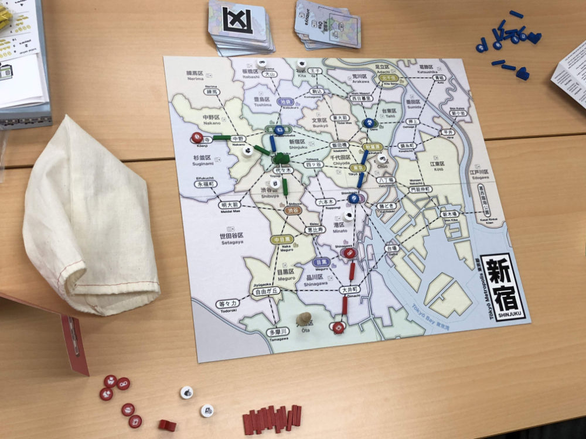
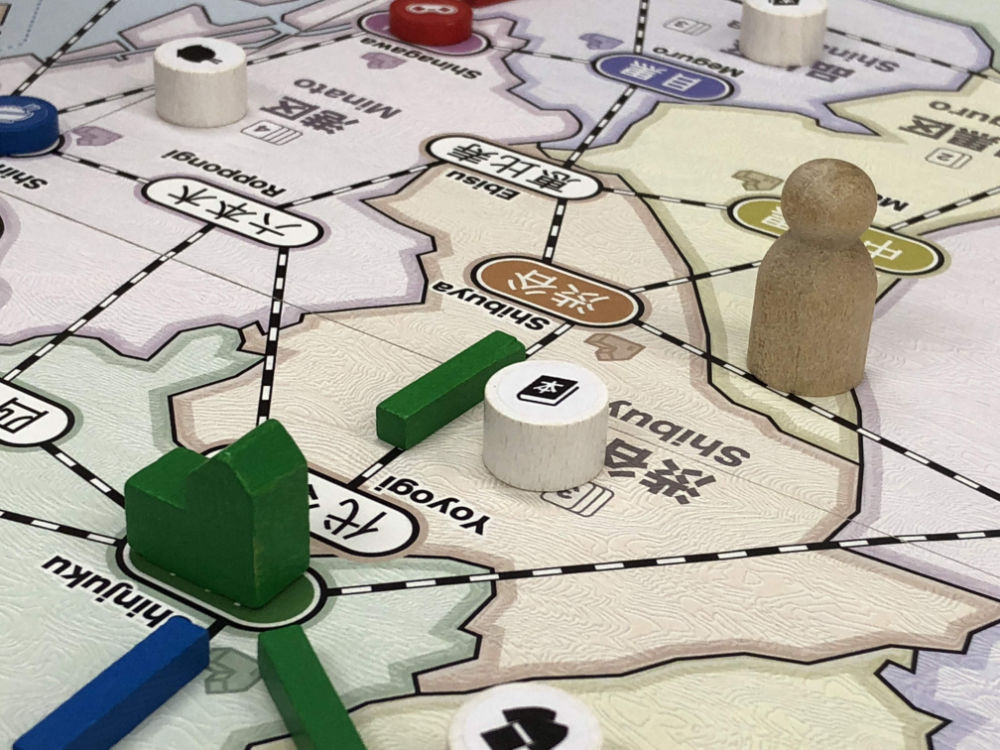
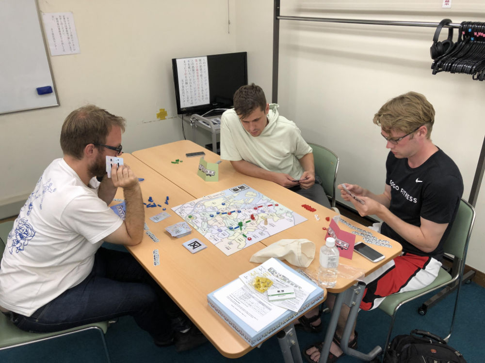
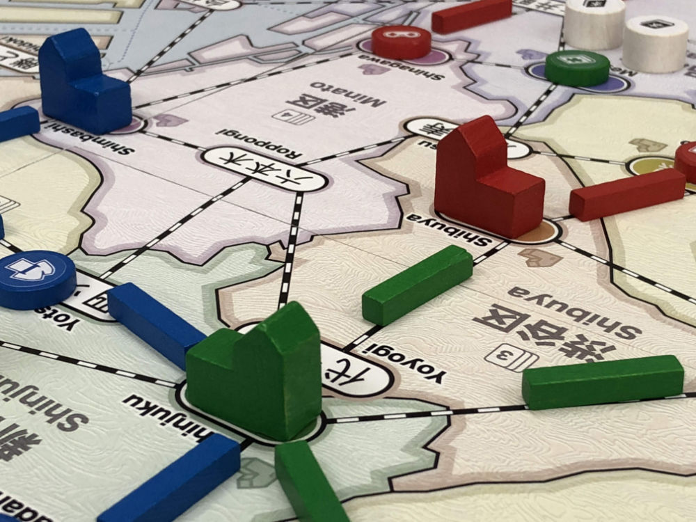
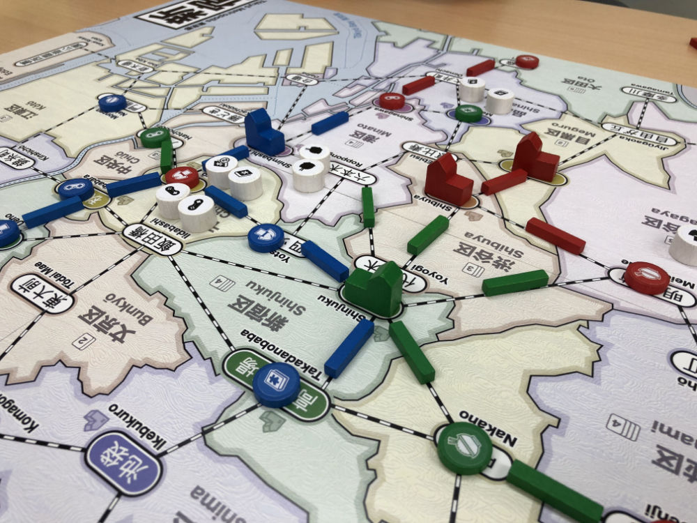
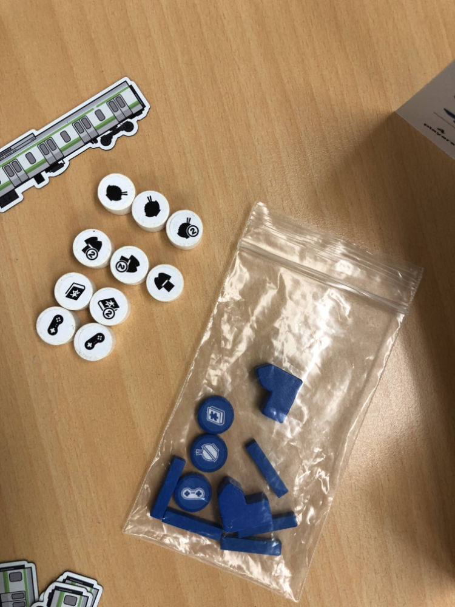
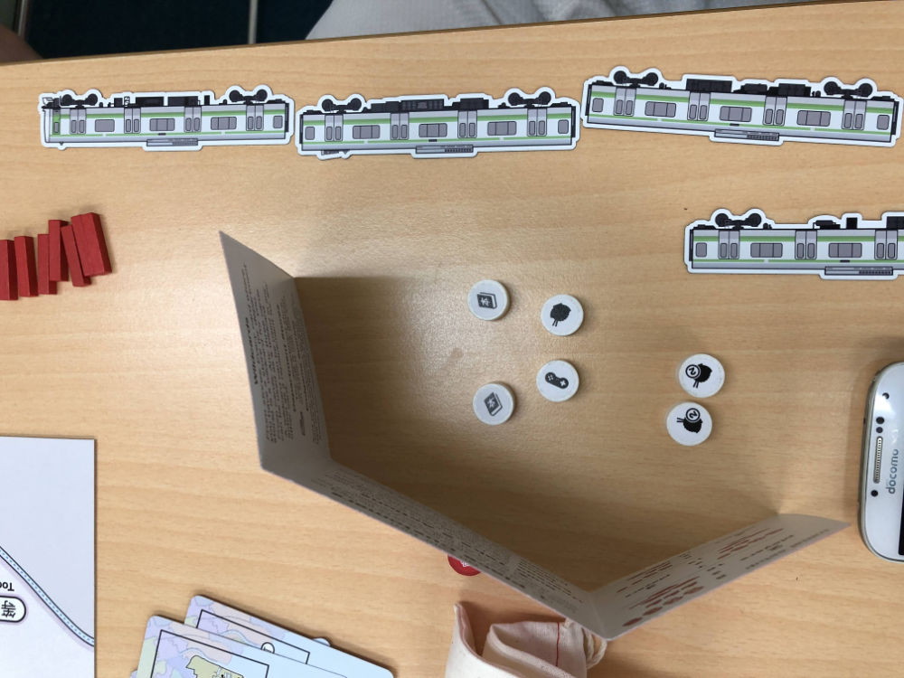
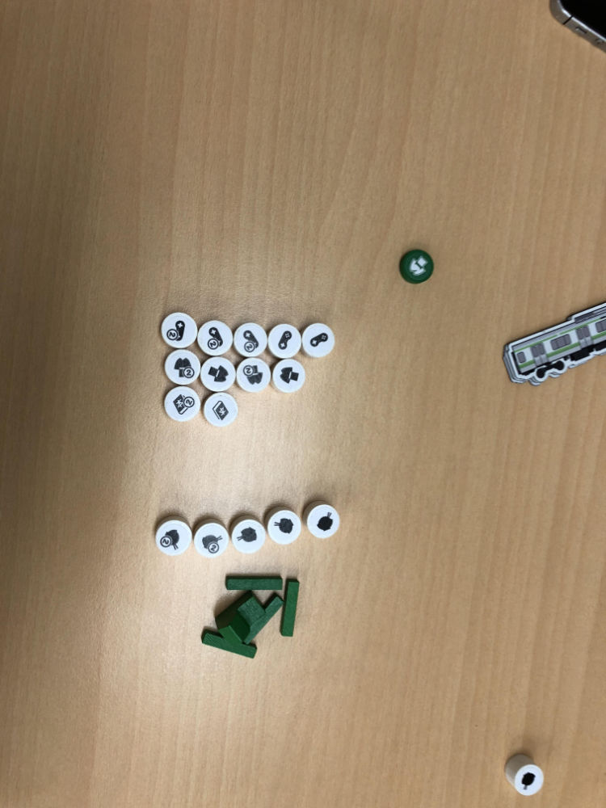

# Playtest #43 - Tokyo (Sangenjaya)

Sun 22 Sept 2019

Participants: Robert, Denis, David

        

## Comments

Playing with princess expansion

Map comments:

* Perhaps use Kichijoji
* Futakotamagawa instead of Todoroki

Rule for determining first player doesn't work if everyone is in Tokyo. Change to last in Shinjuku station. Although that won't work if people play in Shinjuku station.

During early game: "Random customer placement - hard to plan"

* Note that this changes in mid-game

Rule reminders (during game):

* Only one store is allowed per station
* One player forgot stores were wild. Was relying on Princess for wilds.

Scores (single/double = total):

|         |    |    |    |    | Score |
| ------- | --- | --- | --- | --- | --- |
| Robert  | 2/1 = 4 |~3/1 = 5~| 2/1 = 4 | 0/2 = 4   | 12 |
| Denis   | 1/2 = 5 | 1/1 = 3 |~3/0 = 3~| 0/0 = 0   |  8 |
| David   |~2/2 = 6~| 1/2 = 5 | 1/2 = 5 | 2/1 = 4   | 14 |

## Suggestions/Actions

For next playtest:

* Make Dept store locations black with white text to make them pop
* Is it possible to sacrifice something to get an extra action?