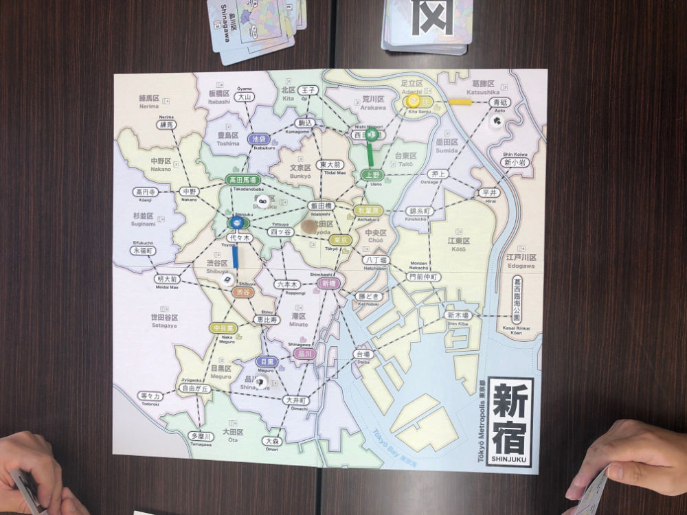
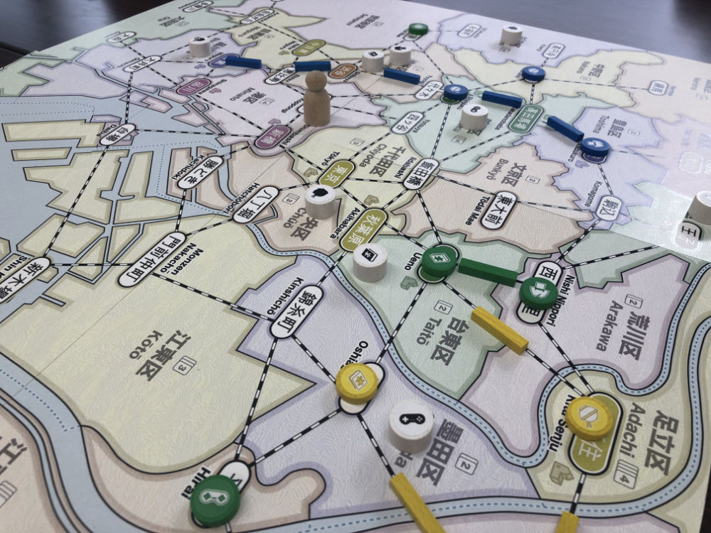
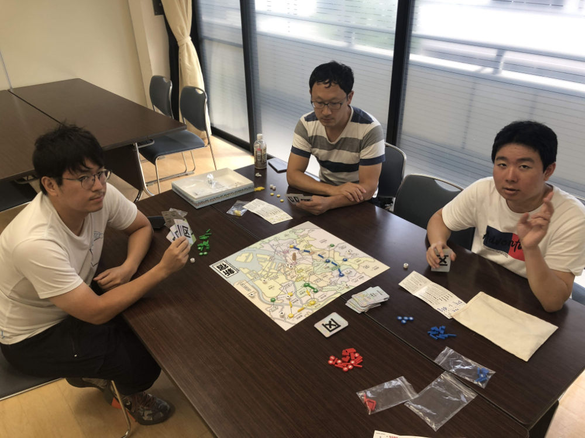
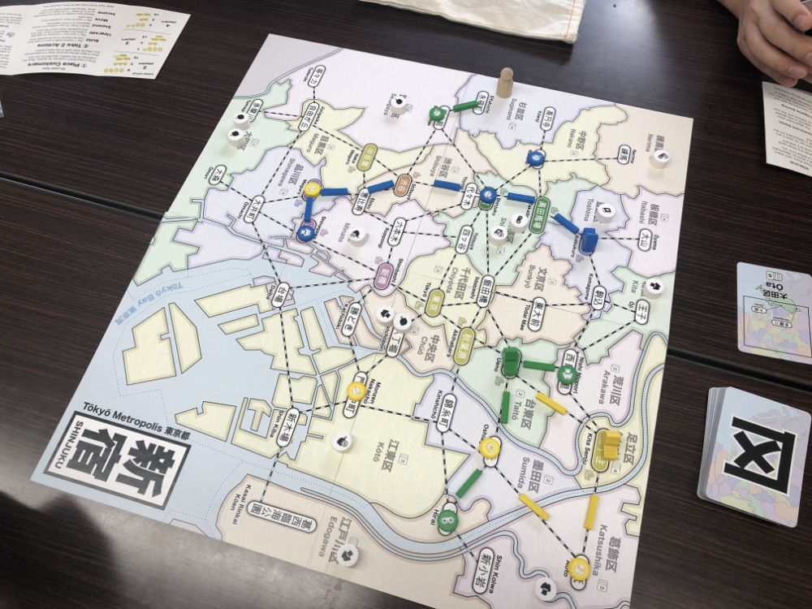
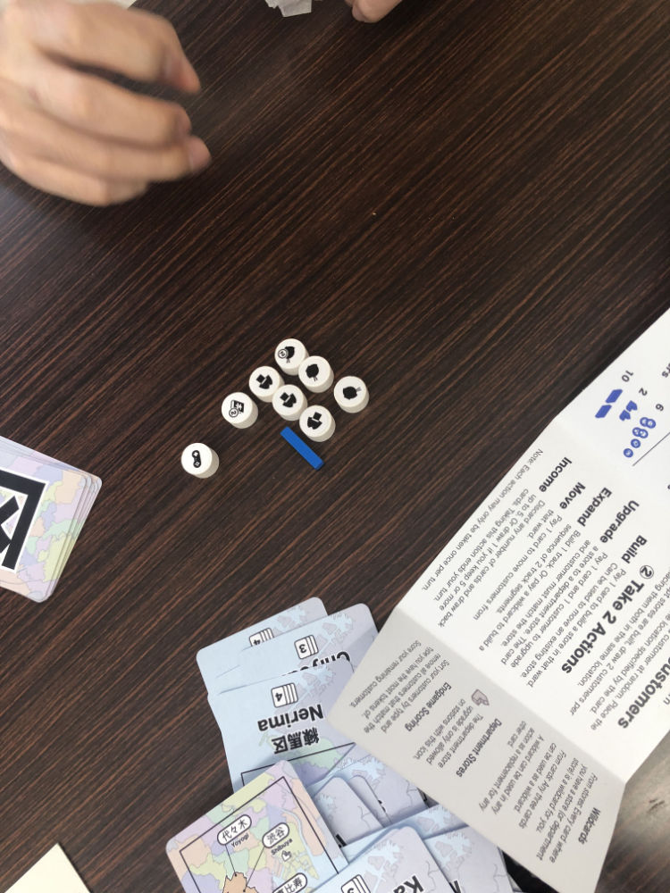
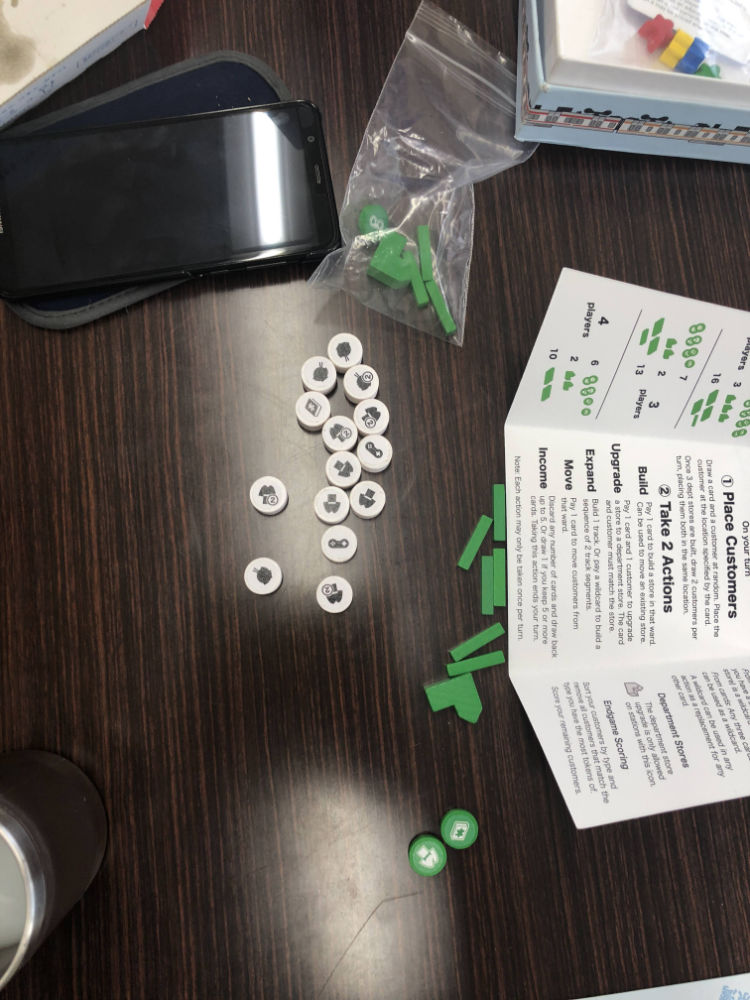
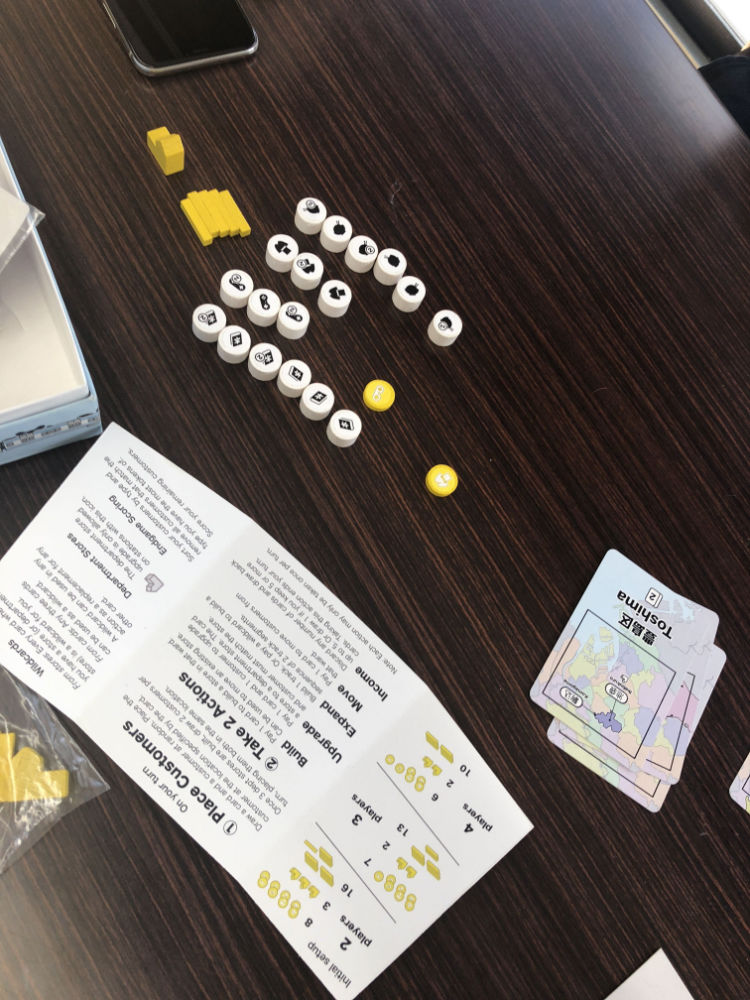
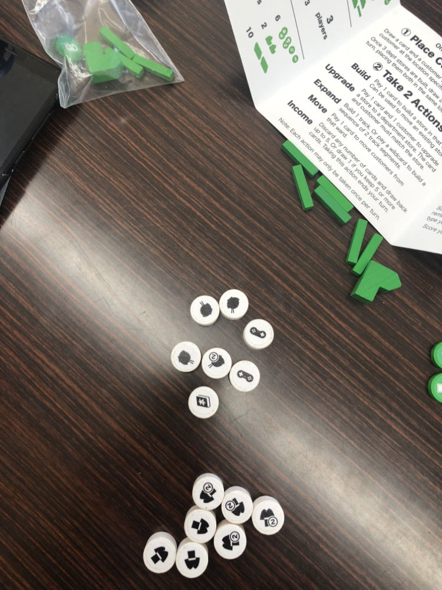

# Playtest #43 - Tokyo (Azabujuban)

Mon 23 Sept 2019

Participants: Ken, Suguru, Kaoru

        

## Comments

Playing with princess expansion

Consider mentioning to new players not to overcommit to a single area (especially early in the game).

One player forgot (until reminded late in the game) that you don't score the customer type that you have the most of.

In this game, **lots** of customers arrived on the east side (around Edogawa), fewer on the west/south side (Ota/Setagaya). Odd random occurrence.

Scores (single/double = total):

|         |    |    |    |    | Score |
| ------- | --- | --- | --- | --- | --- |
| Ken     | 2/1 = 4 |~3/0 = 3~| 0/2 = 2 | 1/0 = 2   |  7 |
| Suguru  | 3/3 = 9 | 1/2 = 3 |~4/2 = 8~| 1/2 = 5   | 17 |
| Kaoru   | 3/1 = 5 |~3/4 = 11~| 1/0 = 1 | 2/0 = 2  |  8 |

## Suggestions/Actions

For next playtest:

* Don't use Princess Mod for initial teaching game