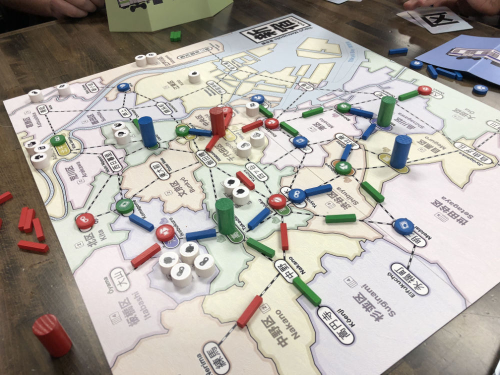

# Playtest #45

Sat 19 Oct 2019

Participants: Stefan, Danny, Brad

          

## Comments

Clarification: You don't automatically gain matching customers that are in the ward where you build a store. You must take the Move action.

Note that the contrast between Sumida and Katsushika could be improved. Changing Katsushika to Green would fix this problem.

Scores (single/double = total):

|         |    |    |    |    | Score |
| ------- | --- | --- | --- | --- | --- |
| Stefan  |~2/3 = 8~| 2/3 = 8 | 0/1 = 2 | 1/0 = 1  | 11 |
| Danny   | 1/1 = 3 | 2/1 = 4 | 2/1 = 4 |~3/1 = 5~ | 11 |
| Brad    |~3/1 = 5~| 1/1 = 3 | 1/1 = 4 | 1/1 = 3  | 10 |

Tiebreaking:

|         |    |    |    |    | Score |
| ------- | --- | --- | --- | --- | --- |
| Stefan  |~2/3 = 8~|~2/3 = 8~| 0/1 = 2 | 1/0 = 1  |  3 |
| Danny   | 1/1 = 3 |~2/1 = 4~| 2/1 = 4 |~3/1 = 5~ |  7 |

## Suggestions/Actions
