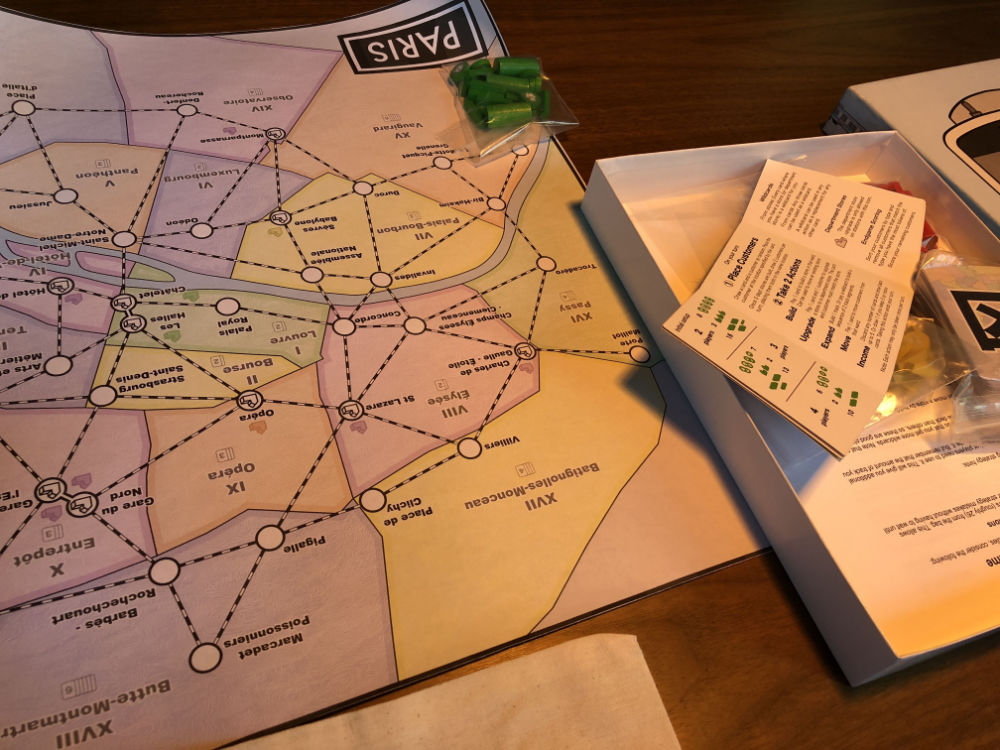
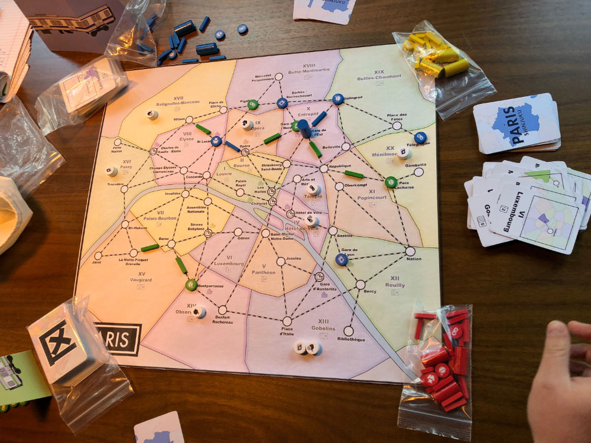
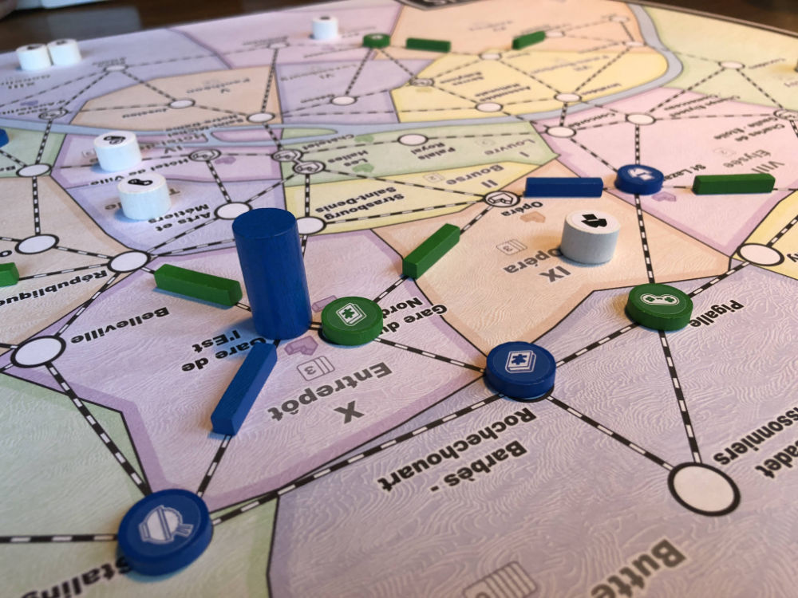
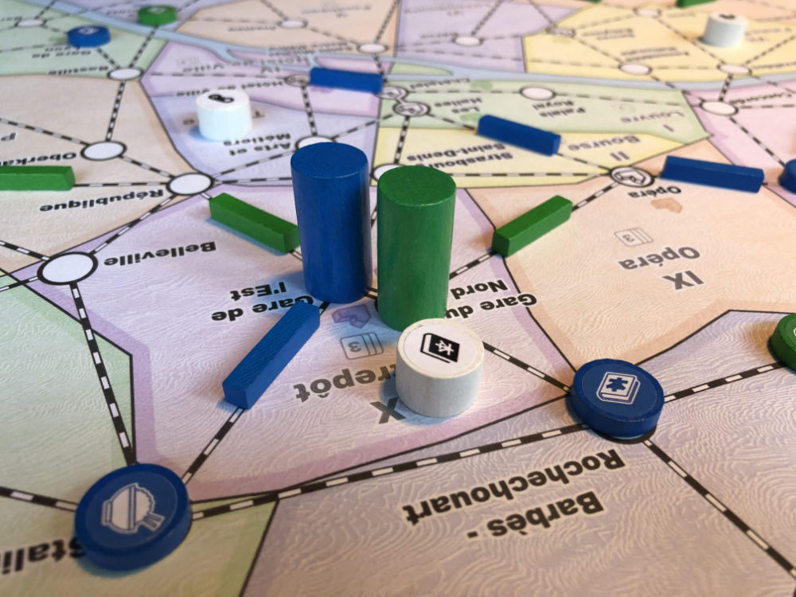
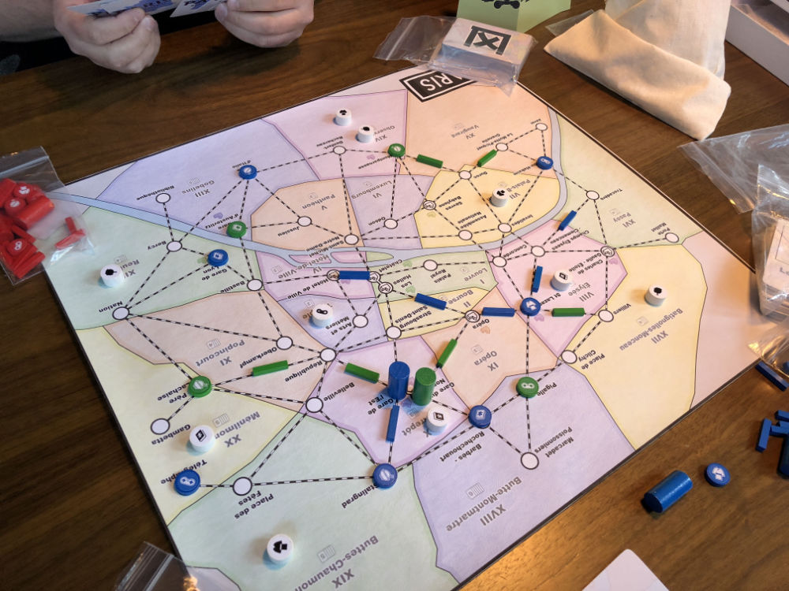
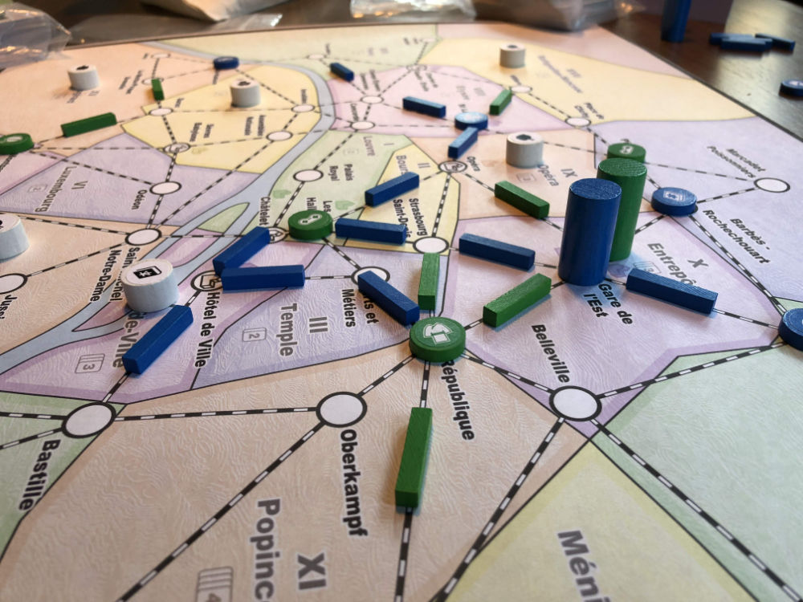
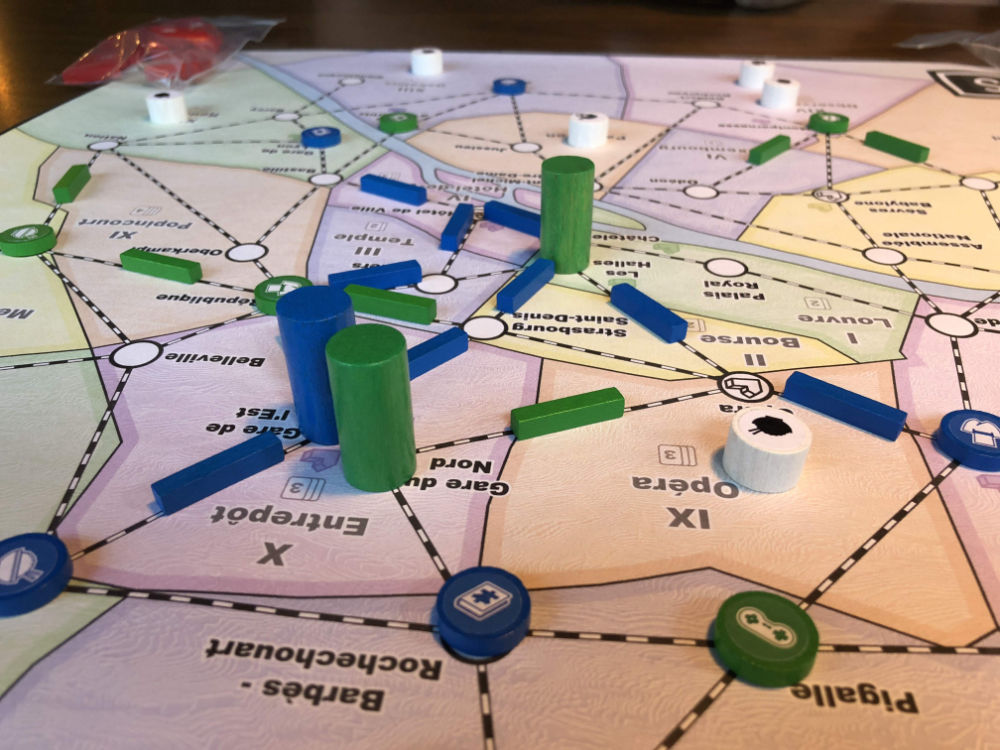
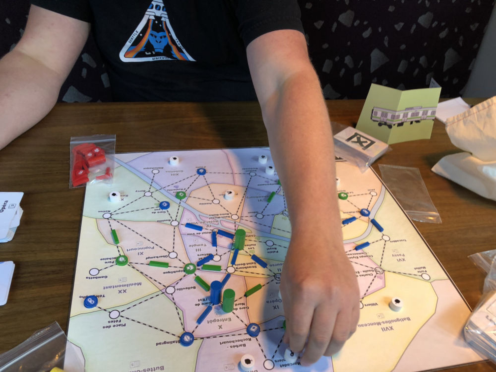
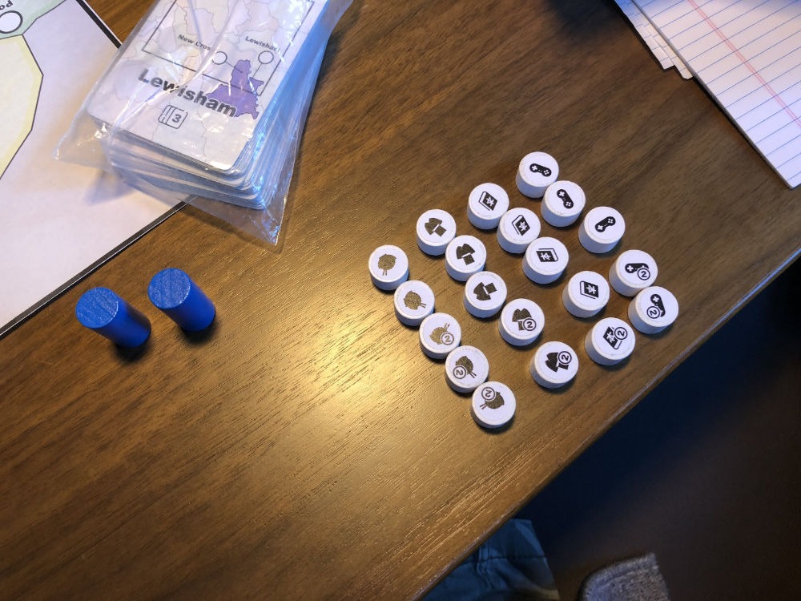
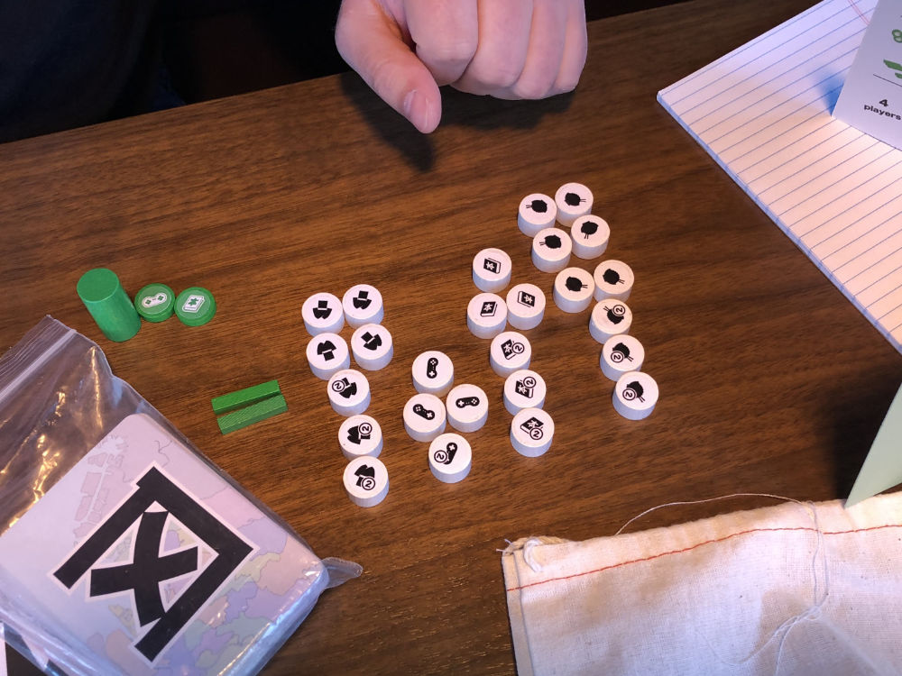

# Playtest #46

Thu 24 Oct 2019

Participants: Adam, Gary

          

## Comments

Testing:

* Paris Map
* 2 player
* Don't discard as part of Income

Scores (single/double = total):

|         |    |    |    |    | Score |
| ------- | --- | --- | --- | --- | --- |
| Adam    |~6/3 = 12~| 4/3 = 10 | 3/3 = 9 | 3/1 = 5  | 24 |
| Gary    | 2/3 =  8 | 3/2 =  7 |~4/1 = 6~| 3/2 = 7  | 22 |

## Suggestions/Actions

Removing discard from Income felt very good. Update rules to include.