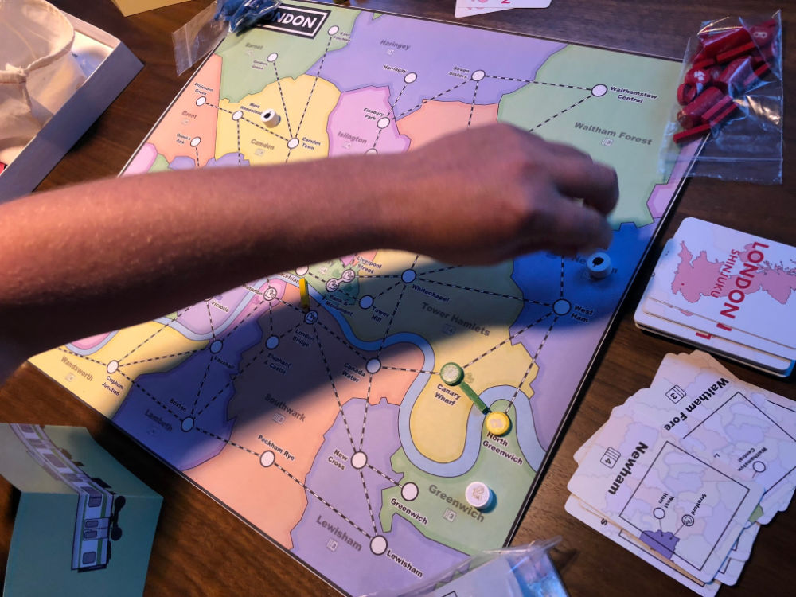
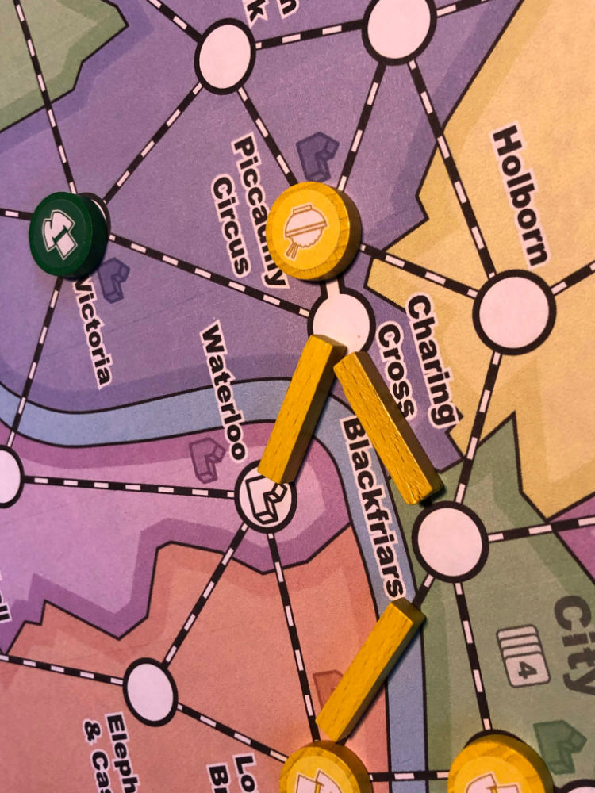
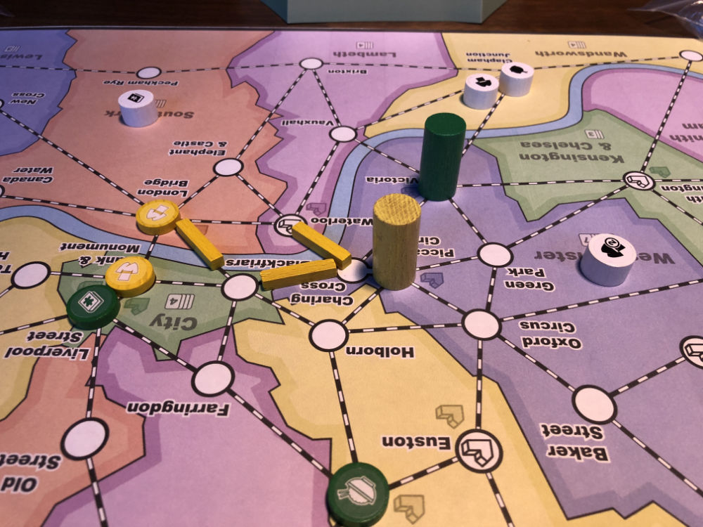
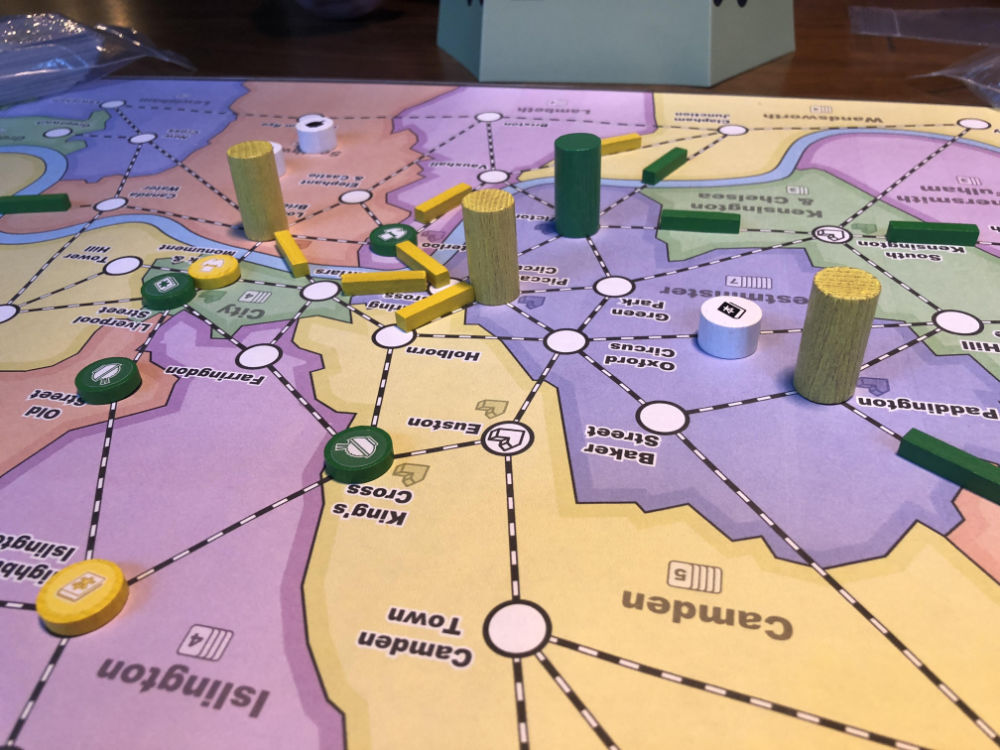
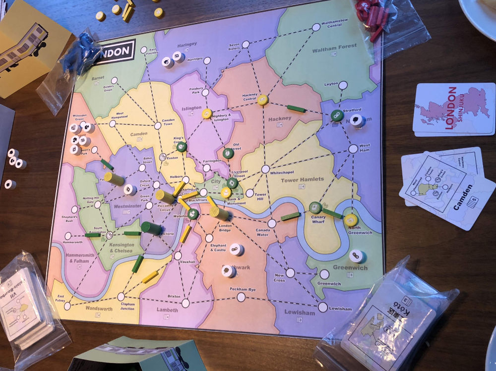
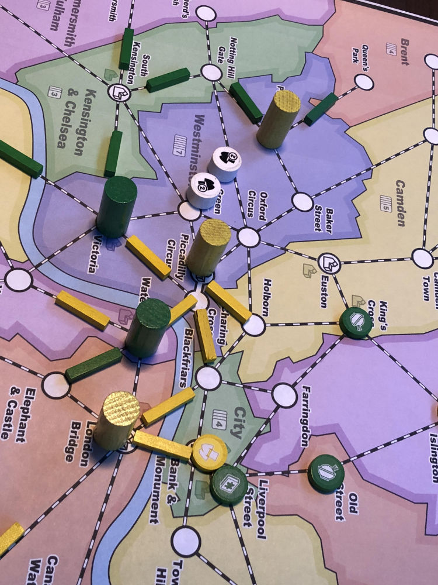
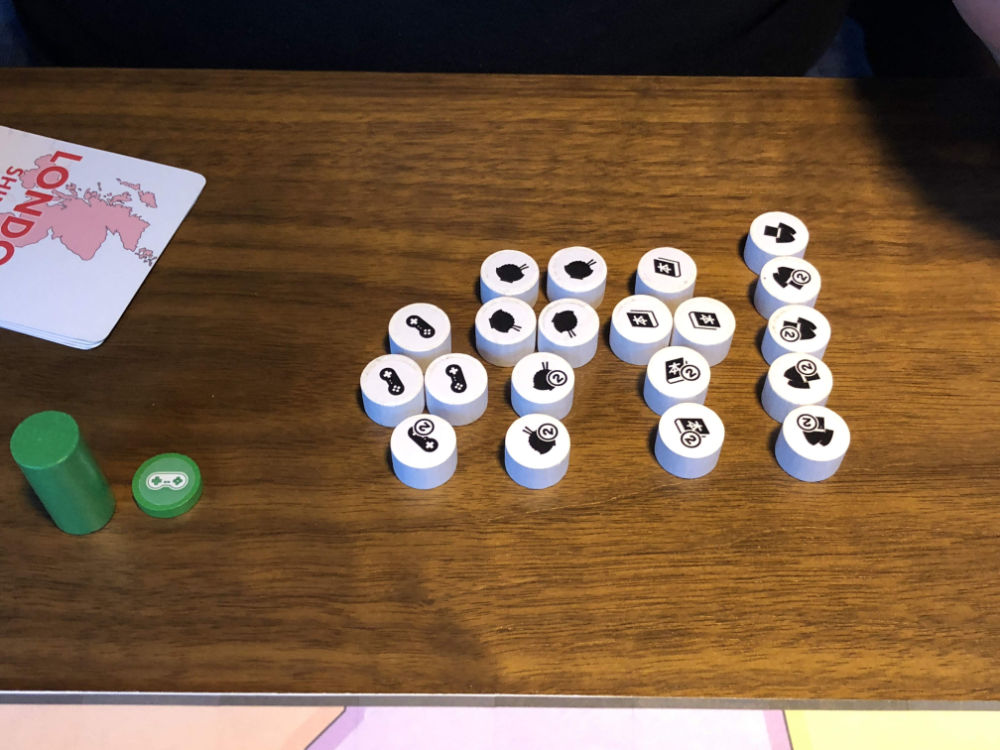
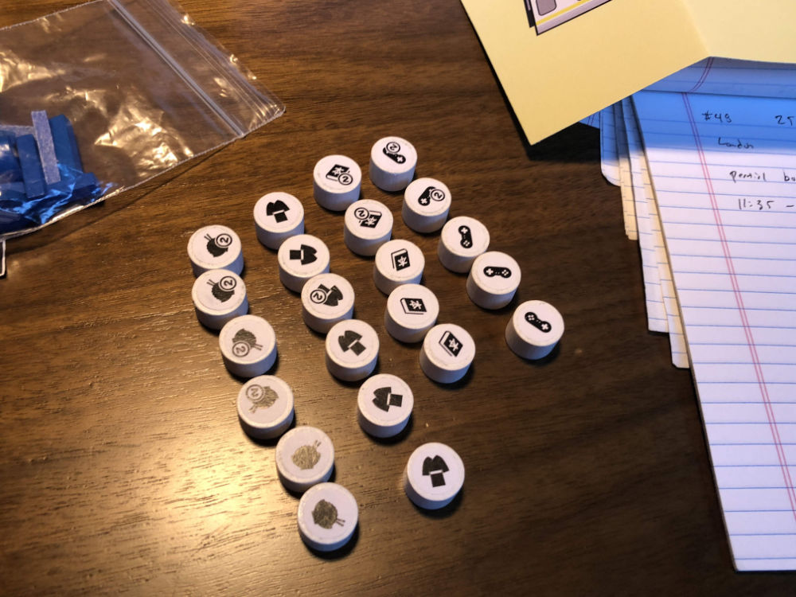
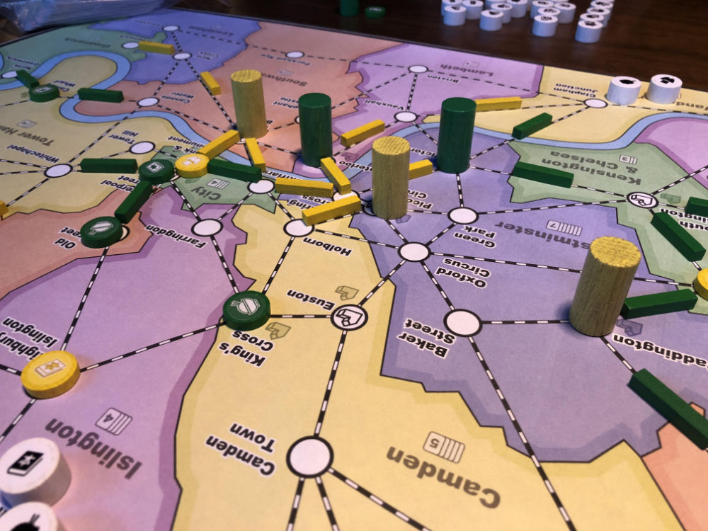

# Playtest #47

Fri 25 Oct 2019

Participants: Adam, Gary

         

## Comments

Testing:

* London Map (first time)
* 2 player

Boroughs along border that are not part of the game should be grey (instead of colored).

Fast game: 11:35 - 12:18

Map too connected with too many close dept stores.

Too many customers arriving in Westminster. Yet too easy to avoid other player's dept stores.

Having Westminster be too large upsets the balance of the game.

Some of the stations on the map are too close together.

Scores (single/double = total):

|         |    |    |    |    | Score |
| ------- | --- | --- | --- | --- | --- |
| Adam    |~4/2 =  8~| 1/4 = 9 | 3/2 = 7 | 3/1 = 5  | 21 |
| Gary    | 2/4 = 10 |~5/1 = 7~| 3/2 = 7 | 3/2 = 7  | 24 |

## Suggestions/Actions

Consider a shared pool of neutral track that is used when a player runs out. Possibly only for double track,

Rework the London map to use the pre-1965 metropolitan boroughs.

* They were much smaller and covered just the central core of London (which is all we care about.
* The board could them zoom in on the core of London and still have about 20 regions. This would allow more interesting stations to be included and they wouldn't be too close together.
