# Playtest #48

Tue 29 Oct 2019

Participants: Josh Y, Adam, Gary

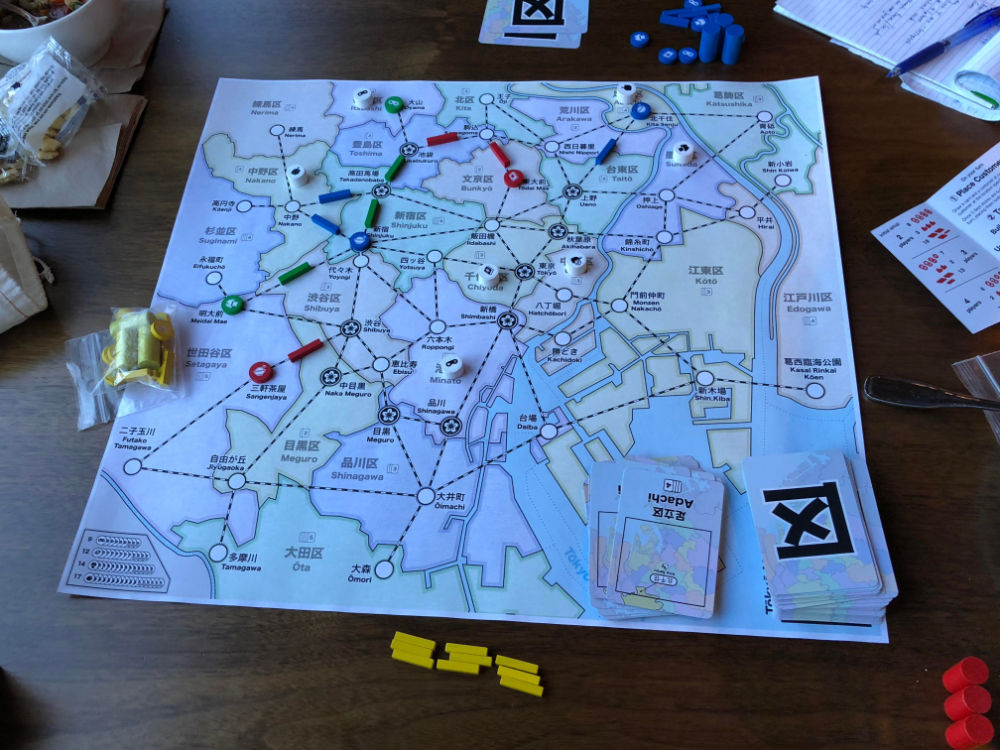 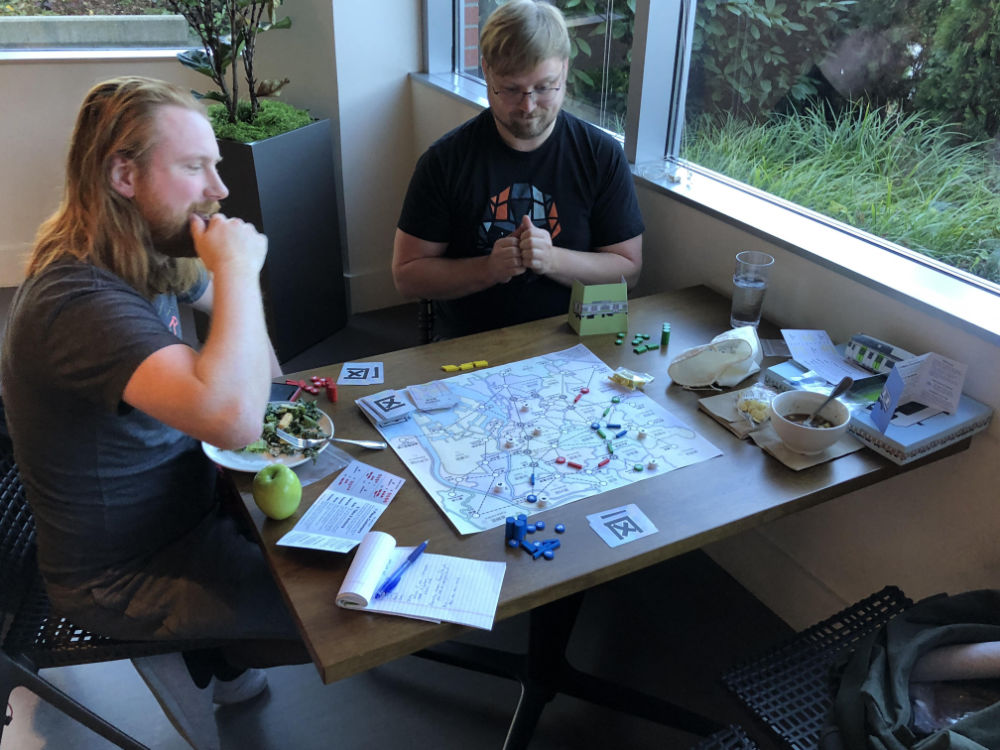 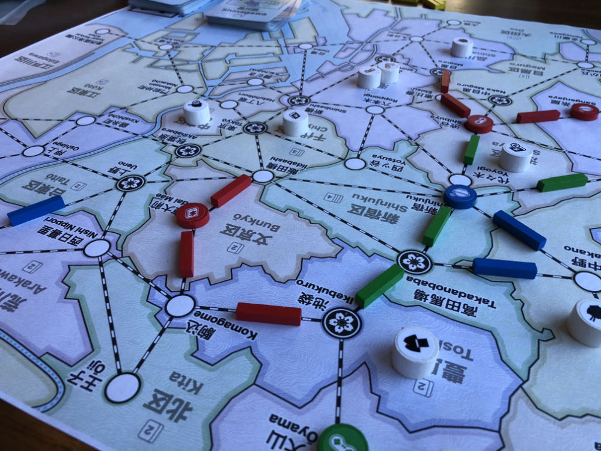 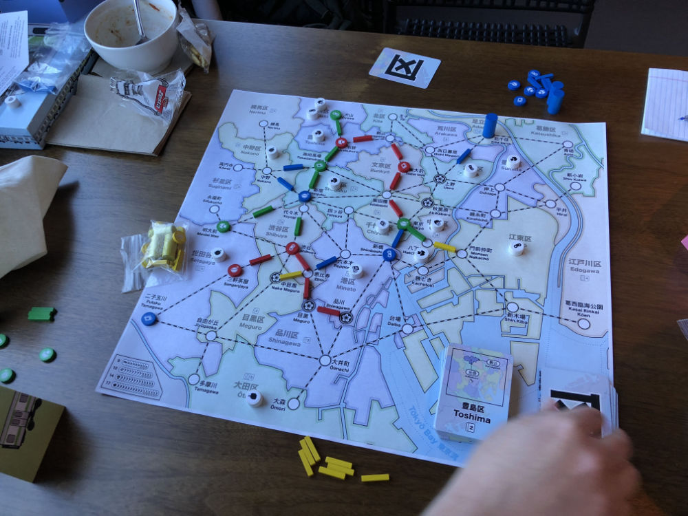 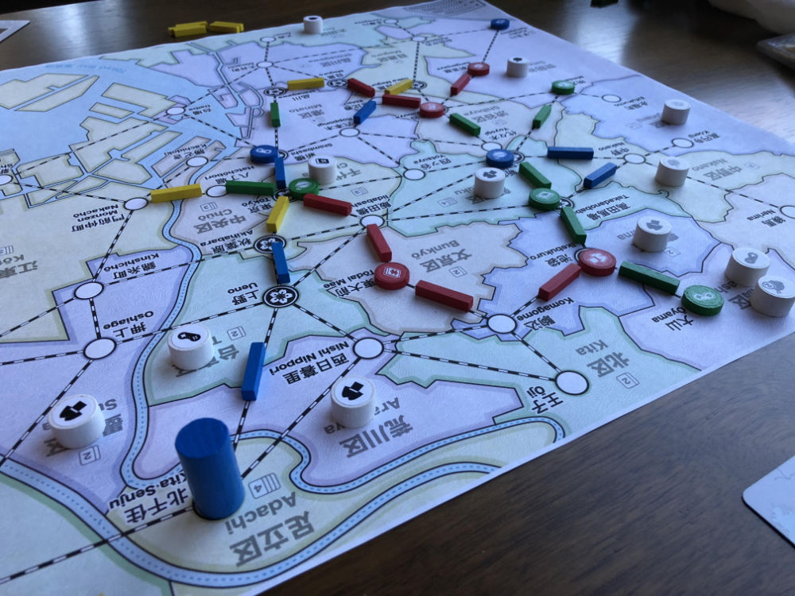 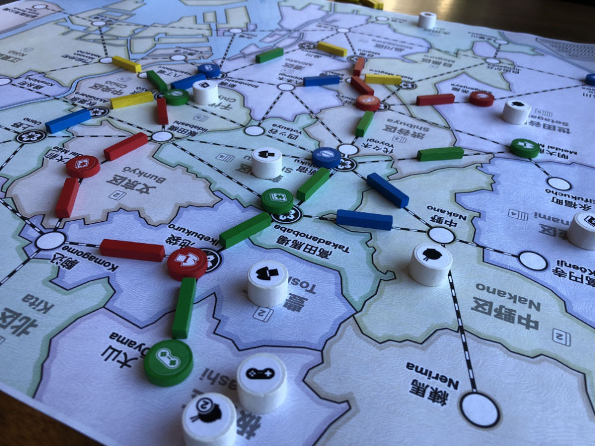 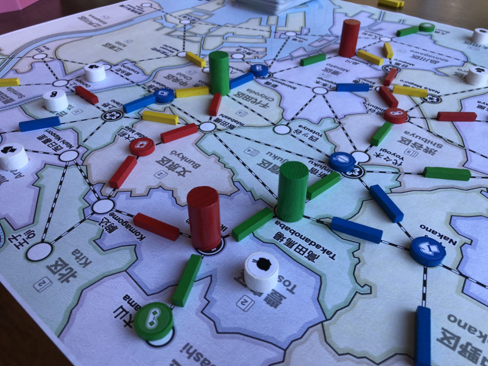 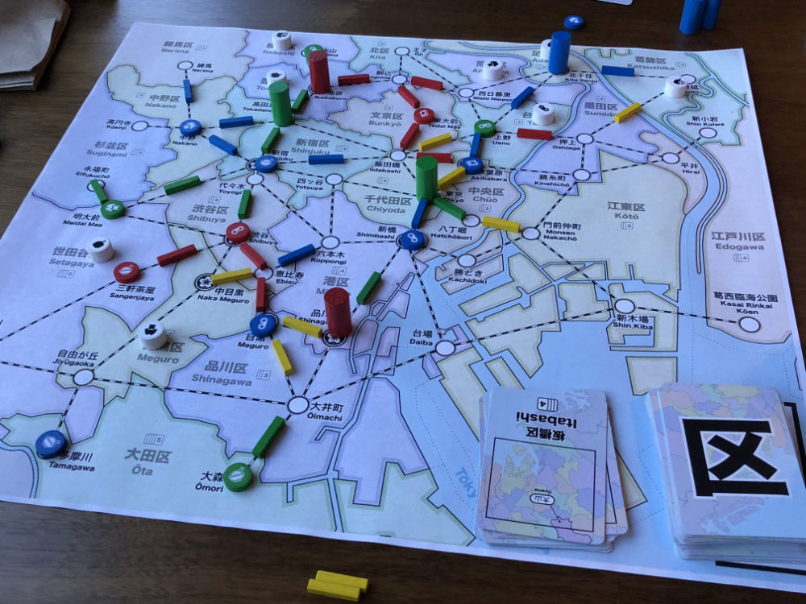 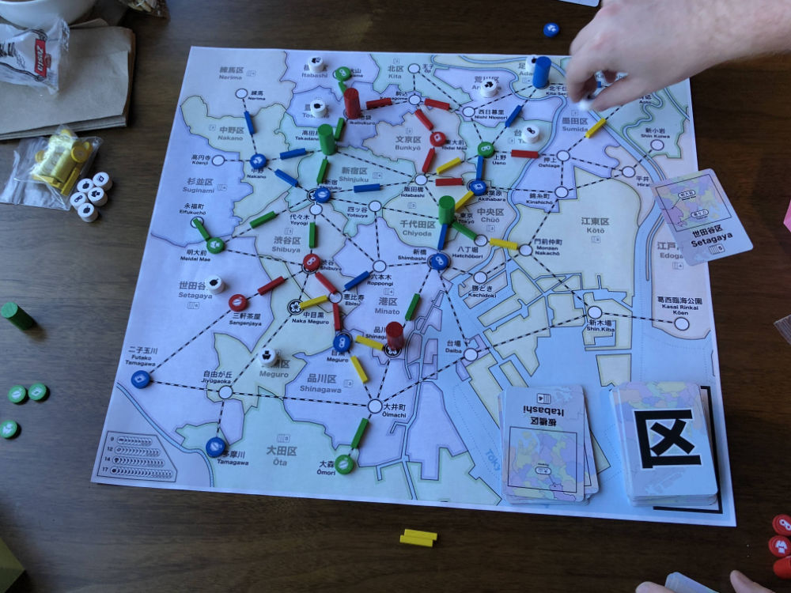 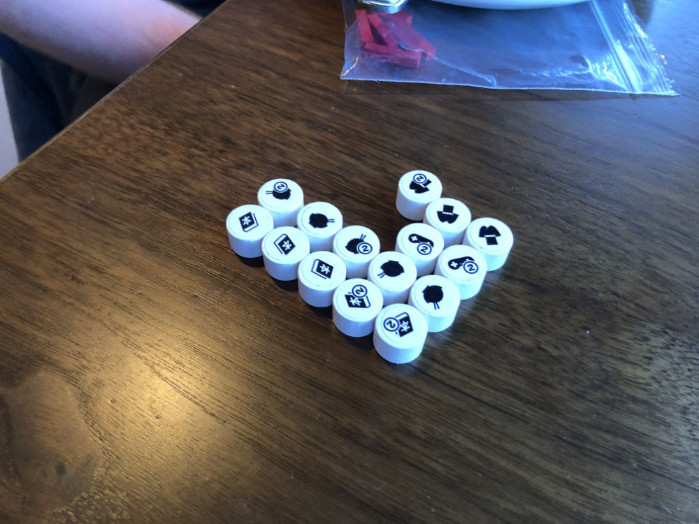 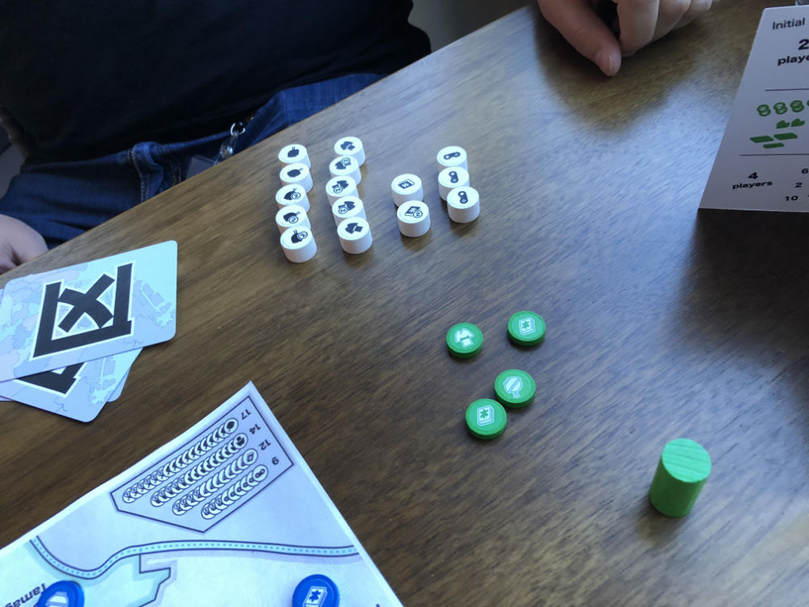 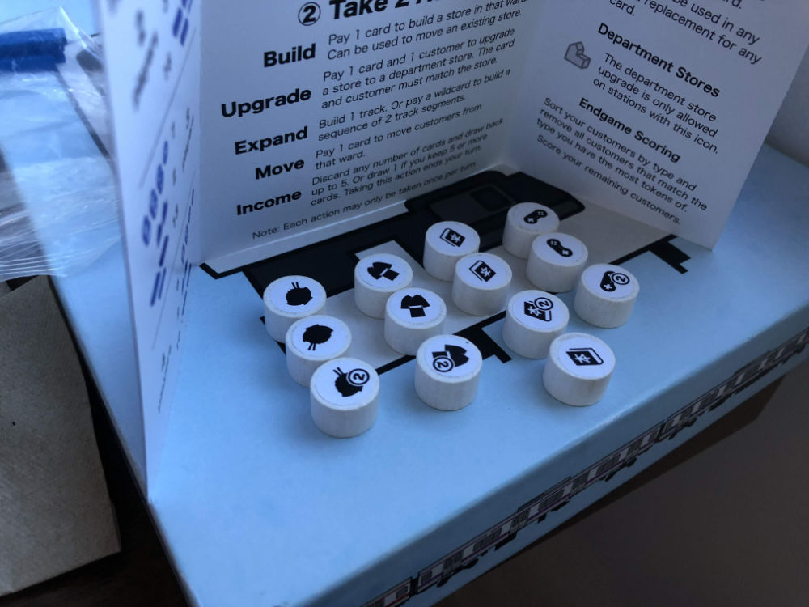 

## Comments

Testing:

* Updated Tokyo map (additional station in Setagaya)
* Track 9/player with additional neutral track
	* You may use neutral track instead of your track
	* Trying to determine if there can be a set amount of track that doesn't need to be adjusted based on player count.

Rules clarification:

* When double expanding through Yoyogi/Shinjuku, you need to play the card that matches the first track that you placed.
* Move:
	* may stop whereever you satisfy a customer
	* must continue at if you haven't satisfied

Josh: "I don't like this game" "This is a good game"

* note: first comment was expressing frustration with his position, not the game in general ^_^

Used 34 track in total

Possibly require that the 2nd track is neutral (if possible). To remove the decision and streamline game.

J: Should neutral track be available at more cost?

J: Is neutral track (and the decision) good for new players?

J: New player question:

* Where to place track?
* Can hints be placed on the map? Like connect dept stores

Another hint: don't commit to a part of the map too early.

Scores (single/double = total):

|         |    |    |    |    | Score |
| ------- | --- | --- | --- | --- | --- |
| Josh    |~3/2 = 7~| 2/1 = 4 | 3/2 = 7 | 0/2 = 4  | 15 |
| Adam    |~2/3 = 8~| 2/3 = 8 | 1/1 = 3 | 3/0 = 3  | 14 |
| Gary    | 2/1 = 4 | 2/1 = 4 |~3/1 = 5~| 2/1 = 4  | 12 |

## Suggestions/Actions

Neutral track was interesting, but probably for an expansion.

Next time:

* Department store locations on the map need to be larger - hard to see when covered
