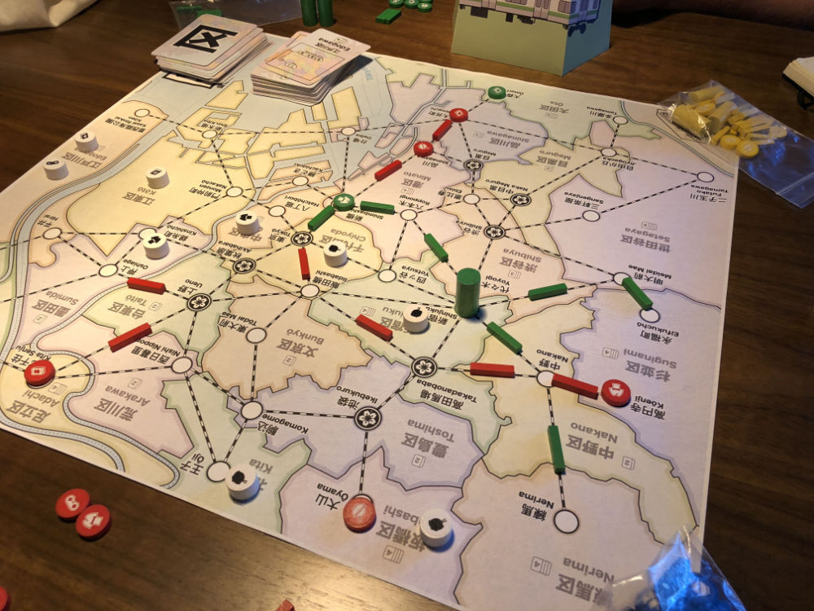
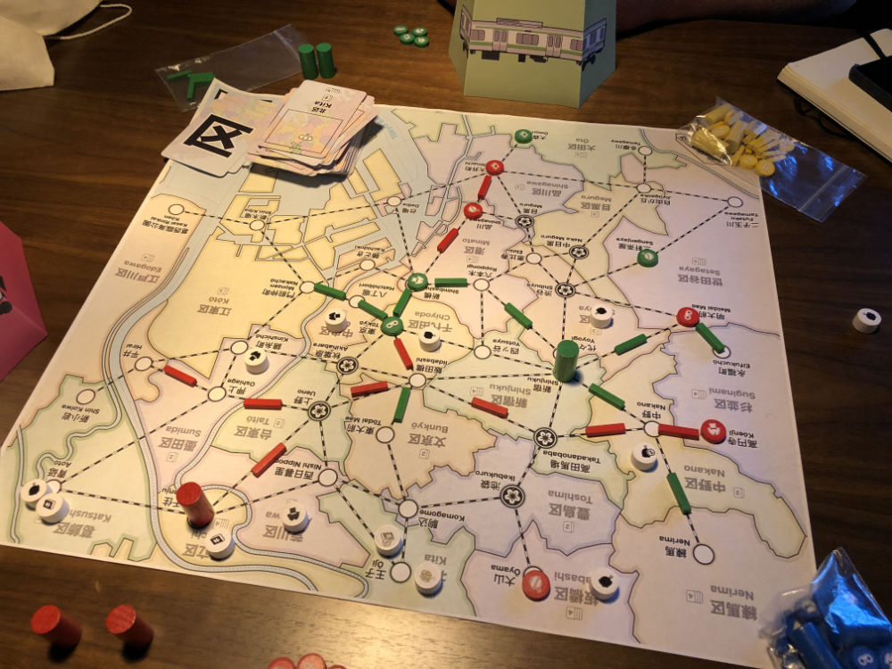
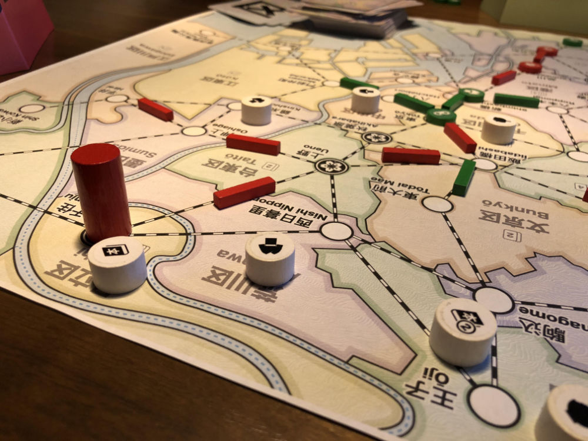
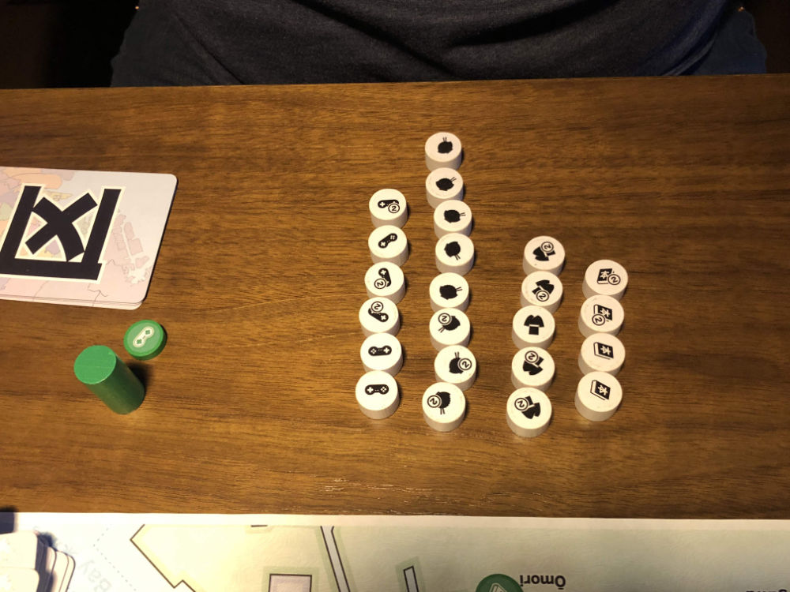
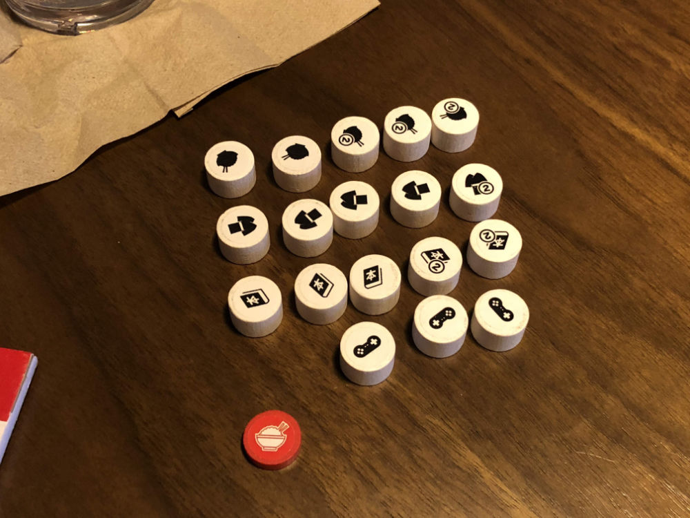
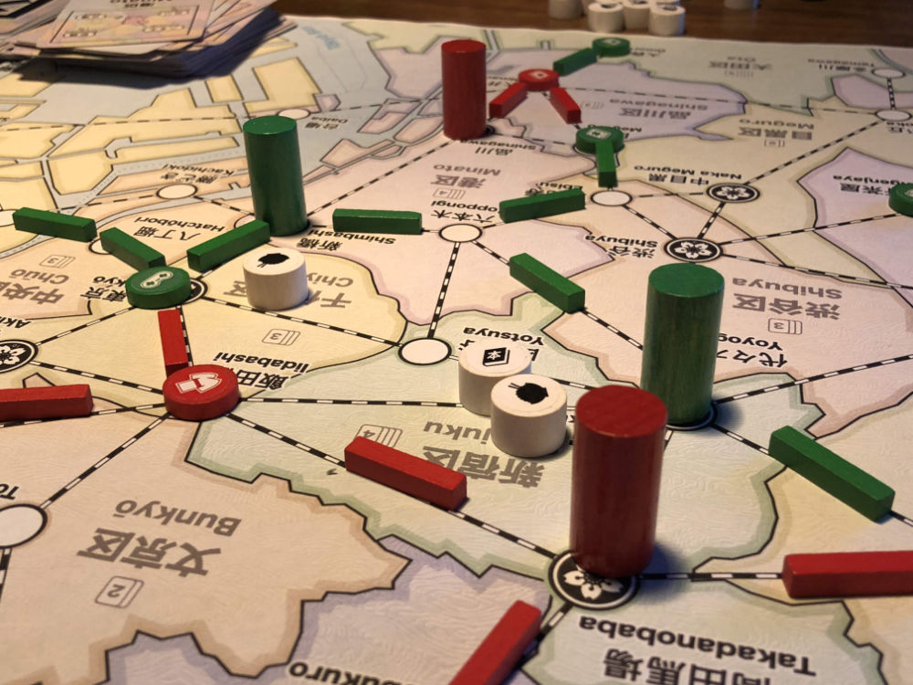
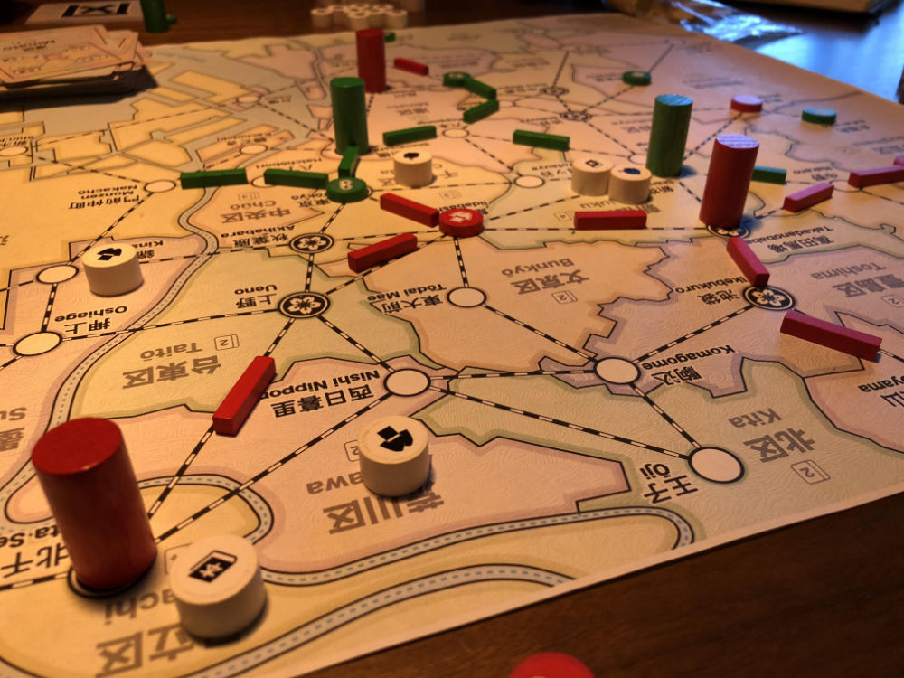
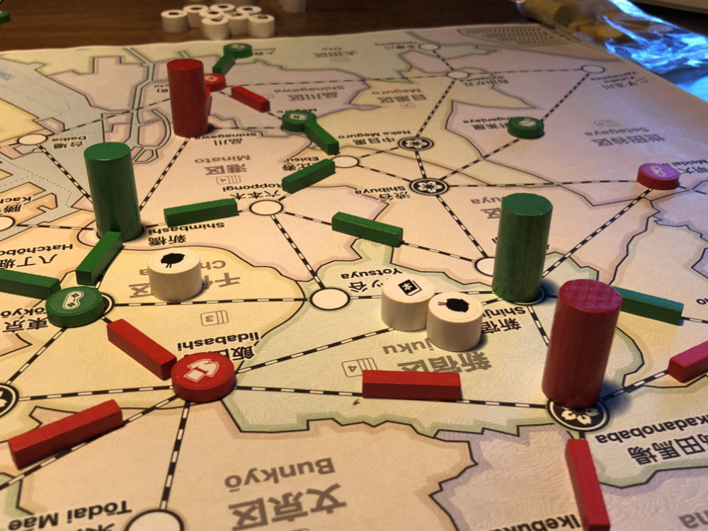

# Playtest #49

Fri 1 Nov 2019

Participants: Adam, Gary

        

## Comments

Testing

* 10 track per player but you can move track on map

A: now you can snipe with track but building it and then moving it away when the other player needs it.

* fix: when track is moved, it is replaced with neutral track

Being able to move track breaks the Track story arc. No longer constrained because you can move from anywhere.

More likely to have fully connected sections of may since track can be moved (relatively low cost) to bypass players.

But it does allow the network to reach new customers that are dropped in new areas.

Scores (single/double = total):

|         |    |    |    |    | Score |
| ------- | --- | --- | --- | --- | --- |
| Adam    |~5/3 = 11~| 1/4 = 9 | 2/2 = 6 | 3/3 = 9  | 24 |
| Gary    | 2/3 =  8 |~4/1 = 6~| 3/2 = 7 | 3/0 = 3  | 18 |

## Suggestions/Actions

next:

* re-test drawing 2 customers into different locations