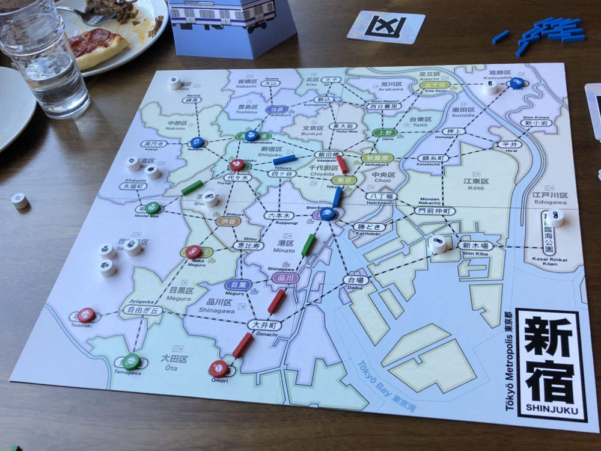

# Playtest #50

Wed 6 Nov 2019

Participants: Josh Y, Adam, Gary

                

## Comments

Testing:

* Placing double-customers in separate locations (instead of placing both in the same location)

J: why not order the actions?
(Re: the rule that Income must be the last action in a turn)

* Adds rule complexity. Is it worth it?
* A: could add a rondelle - perhaps an expansion

J: For the last half I wanted to do something but wasn't able to do it. Trying to get more video games. Probably should have tried for books.

* Didn't have a customer dist reference to know that Video Games were rare. There probably weren't any more to get.

Impact of having double-customers sent to different locations:

* Smaller clumps. Didn't have a clump of 4 and only as clumps of 3
* Fewer big gunshot moments.

Having more customers in the game:

* Perhaps try having more customers but arrive more often
* Have a customer that draws extras customers. There is an expansion for that. Should it be brought into core.
* How many customers would be needed to start the game with 2 customer draws
* How would that affect the game timer/timing?

What is Fun in this game?

* Big moves across board
* Needing to give other players a customer

A: A crazy change:

* Another free action: "walk" move customers 
* Like in Kaiju
* Feels too big for a free action
* Or move just a single customer
* That would address the problem with single customers on the board not worth picking up

Scores (single/double = total):

|         |    |    |    |    | Score |
| ------- | --- | --- | --- | --- | --- |
| Gary    | 0/2 =  4 | 0/2 = 4 |~2/1 = 4~| 1/2 = 5 | 13 |
| Josh    | 2/2 =  6 |~3/2 = 7~| 0/0 = 0 | 2/0 = 2 |  8 |
| Adam    | 2/1 =  4 | 2/0 = 2 | 1/1 = 3 |~3/1 = 5~|  9 |

## Suggestions/Actions

Todo:

* Revert to placing 2 customers in same location
* Consider adding more customers