# Playtest #51

Thu 14 Nov 2019

Participants: Josh Y, Adam, Gary

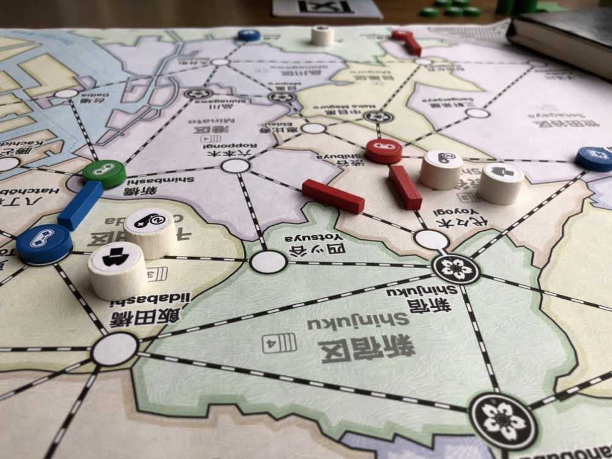 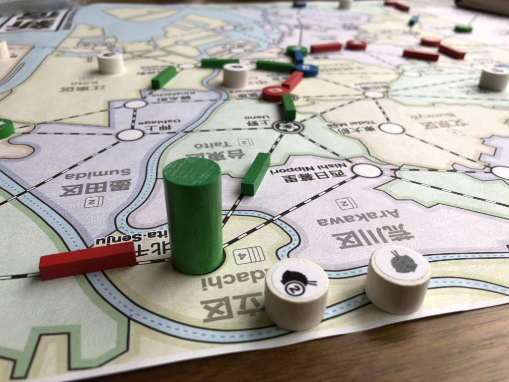 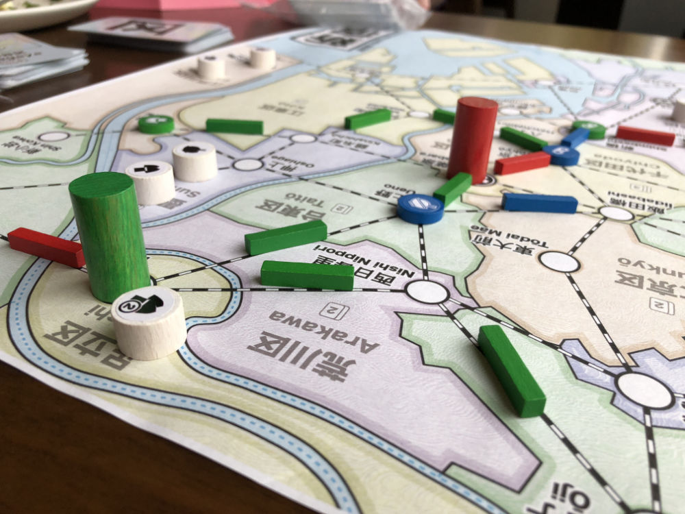 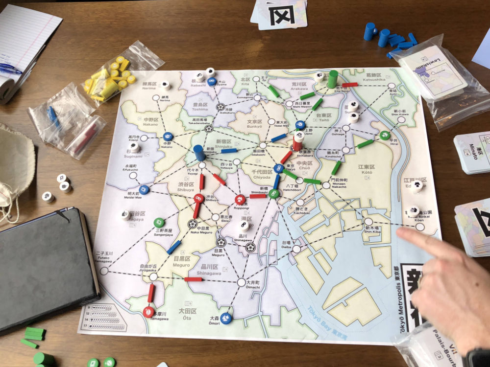 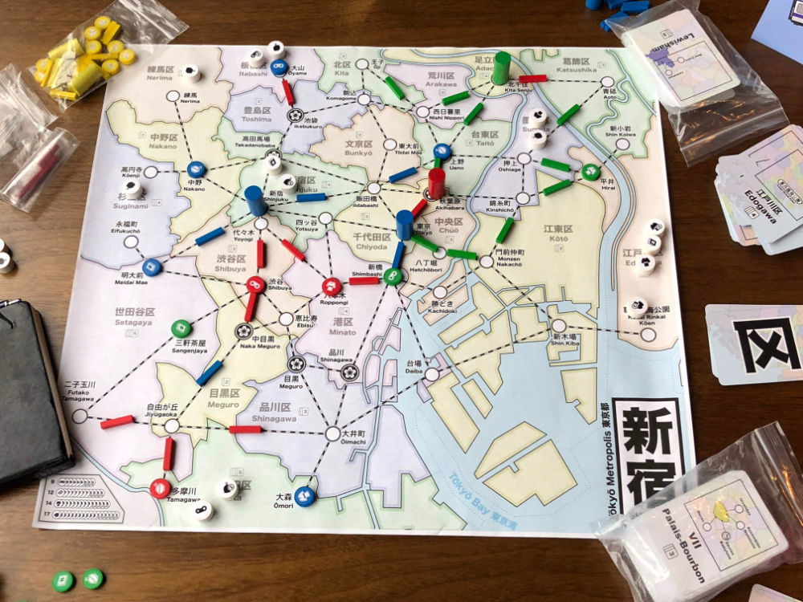 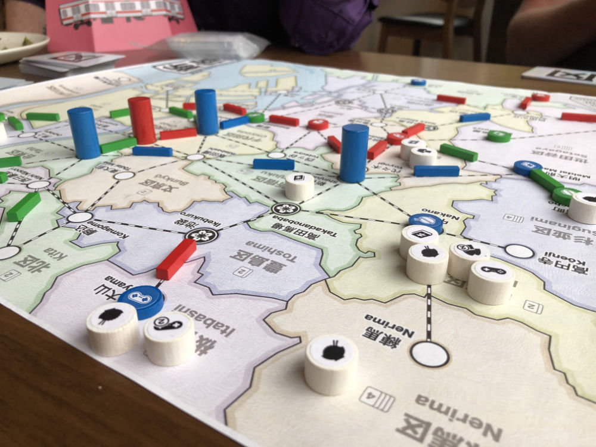 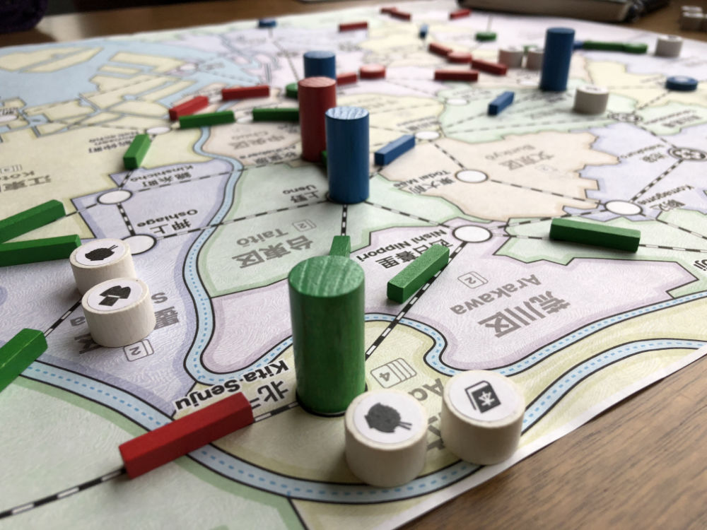 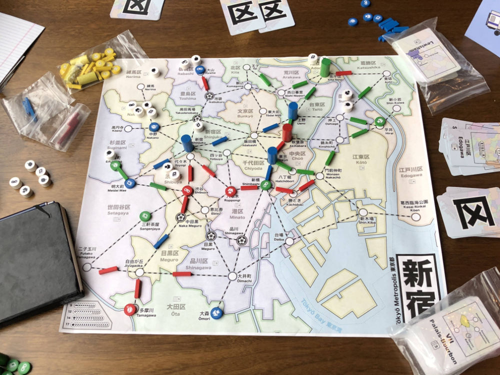 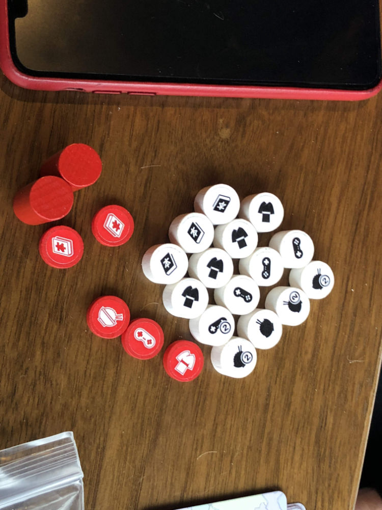 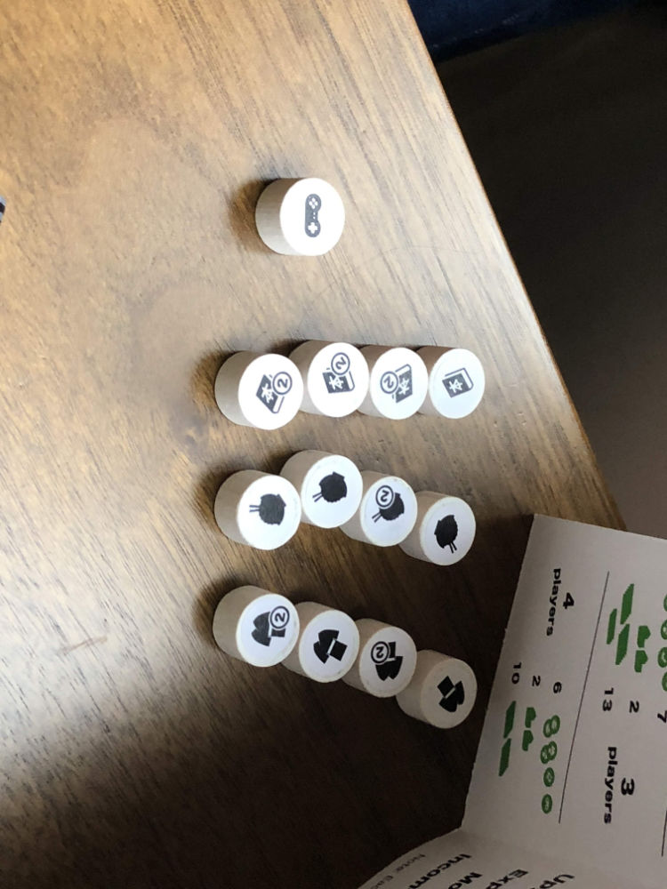 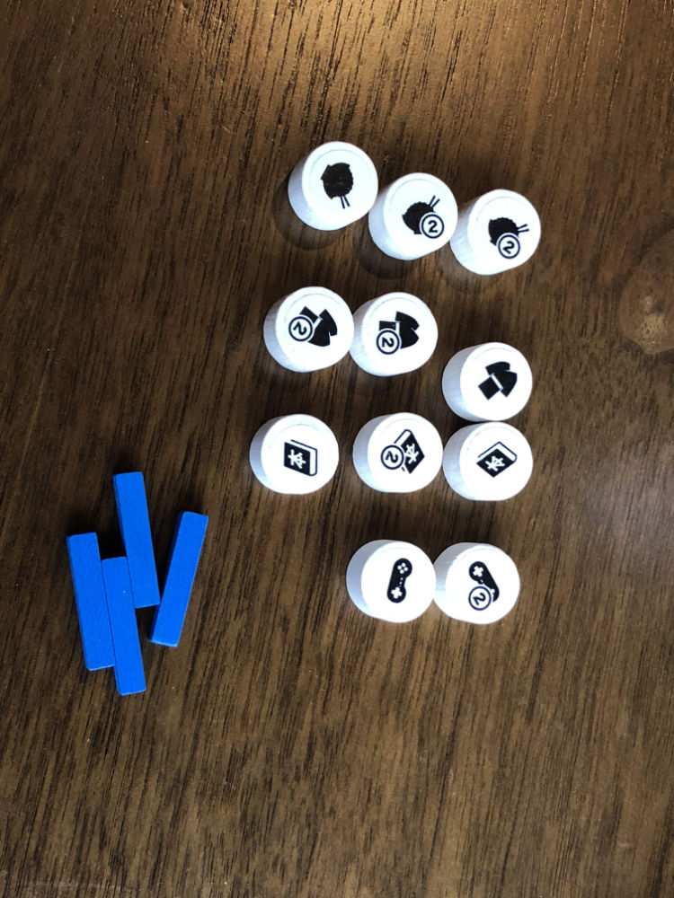 

## Comments

Testing:

* New action: Move a single customer along a single segment of track - skipping stores
	* Can only move customer if they are alone in ward
	* Idea is to allow customers to be grouped my moving them together

Skipping stores feels odd

A: Does this rule change encourage suboptimal play?

Also, this is degenerate for 2 players:

* Can move customer back and forth
* cf. Ko rules in Go

A: change Move action - must satisfy at least 2 customers. To encourage bigger moves

A: Note: If small Move must follow track, then it can easily be moved back (because there is track).

* Small move is most useful as a 1st move followed by a real move.

J: "Gary, sometimes you make me sad"

New action is not powerful enough to use. Should a more powerful version be added/used?

Perhaps allowing a single customer to be extracted from a group and moved to a neighboring ward.

Scores (single/double = total):

|         |    |    |    |    | Score |
| ------- | --- | --- | --- | --- | --- |
| Josh    | 1/3 = 7 |~4/0 = 4~| 3/0 = 3 | 3/1 = 5  | 15 |
| Adam    |~3/1 = 5~| 2/2 = 6 | 1/3 = 7 | 1/0 = 1  | 14 |
| Gary    | 1/2 = 5 | 1/2 = 5 |~2/1 = 4~| 1/1 = 3  | 13 |

## Suggestions/Actions

None. Next playtest will be with new players.