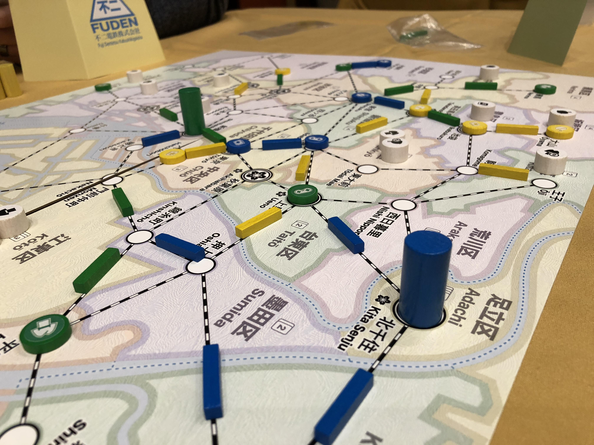

# Playtest #53

Tue 19 Nov 2019 (at Tabletop Network)

Participants: Gary K, Isaac C, Jason K

                 

## Comments

Testing:

* New players

What is the best way to hold cards? Maybe add an Index in the corner.

I: Once network is built, random where the customer arrives

What about final round just assume everyone has 2 wildcards

I: didn't give customers to other players very often

I felt too open, you could avoid other players to easily. Point in middle when you cared about other stores - but you could work around to avoid

I: what about spending 2 cards to upgrade to dept store?

Scores (single/double = total):

|         |    |    |    |    | Score |
| ------- | --- | --- | --- | --- | --- |
| Gary    |~2/1 =  4~| 1/2 = 5 | 2/1 = 4 | 1/2 = 5  | 14 |
| Issac   | 4/2 =  8 |~5/1 = 7~| 3/2 = 7 | 2/0 = 2  | 17 |
| Jason   | 1/3 =  7 |~3/2 = 7~| 3/1 = 5 | 2/1 = 4  | 16 |

## Suggestions/Actions

To test:

* just assume that everyone has 2 wildcards for final round

