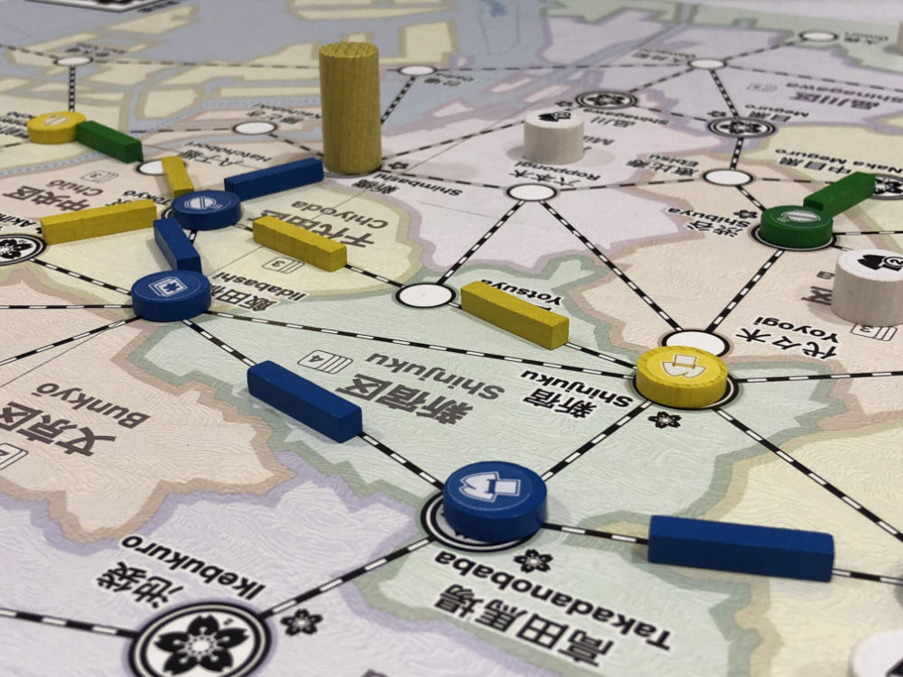

# Playtest #54

Sat 23 Nov 2019

Participants: Nathan H, Isaac S, Gary K

       

## Comments

Testing:

* New players

Stopped game halfway to focus on comments.

I: Discarding the most customers feels bad and is against the theme.

* And can be used to attack other players
* set collection: 2/3/4-sets give bonus of 3/5/8 points at end of game

I: explanation for track is confusing. counter-intuitive to expand from either side.

I: don't like Knizia scoring - feels bad

I: possibly add waiting area on map for customers, with a foot path leading to the stations

I: Move action says "Move ... from their ward", but a single customer can be picked up and dropped off at a store in the same ward. Clarify rule description

I: would like to refer to the player aid on the shield, but can't move it because it's hiding customers.

I: can you pick up customers along the way? No

I: For card: move map to bottom, and add index in top corner. so that you can splay the cards and make them easier to see.

I: suggestion: for customers to move along at least 1 track. it fits the theme. it removes the single customer match. adds more clumps, more moves along track

N: Wanted to place track early to avoid taking an Income action

I: random - cards are limited. the outer ring is valuable - other players will trigger

N: perhaps have "marketing" action to determine where customers will go

I: lack of control over random placement of customers

I: Avoided doing 3 card as wild because the rules explanation indicated that is was an "expensive" way to get wildcards.

* In rules explanation, I said, "Only 5 cards in hand, so 3 cards is expensive"

N: pay 1 card to place 2nd track?

I: Hand in game didn't feel like an average hand.

Bigger problem: cf Carcassonne. it should eliminate 2-space cities because they are too obvious

I: Change it so that Move must use track

I: Move must end at store. Misunderstood this rule at first.

I: Don't allow moving single customers

I: didn't like being able to stop while there were still customers that could be matched.

* If adjacent to a store that matches, then you must continue
* good for network. forces more good moves.
* annoyed by stopping just before a store:
	* E.g., Food -> Book -> Clothing
	* Move customers from Food -> Book, but stop there with unresolved Clothing customer
* blocking players by rules = bad; blocking by intention = better

I: Perhaps wilds could be more useful if they matched color

I: game needs to be heavier to support 3-card wild

* the flexibility of the 3 card wild means that you move more slowly (because you're spending more cards and need to take more Income)
* Strengthen draw action, eg: draw 3 choose 1
* cards are too strict, need to loosen it up
* game is not bettern when taking Income actions

I: last 3rd of game has slow velocity

I: what is the least fun turn? how to prevent it? what is the worst possible set of cards to start with and how can that be improved?

I: get network build faster

I: for the double track description: "2 connect segments of track as long as least one touches the card played"  "city of origin"

I: Compare with Concordia (need to check context for this comment)

I: Terminology

* Build -> "Open" store. WRT moving stores, is that needed?
* Upgrade
* Expand -> "Lay Track"
* Move: OK. Maybe "Ride" "Commute" "Shop" - although shop is ambiguous
* Income

I: Move action

* players need to move until the reach a terminus (based on current network)
* must move until you can't move - until you have to stop
* force long travel
* play a game where you can do any valid Move

I: Perhaps start game with hand limit of 8

* keep that limit until you reach 5 stores on the map

Ralph (from Eagle Gryphon games)

* distracting Japanese text on board - overwhelming flavor text
* Sakura icon could be printed on back side of store (to indicate dept stores). But screen printing double-sided is expensive

## Suggestions/Actions

Todo:

* update cards: put index in corner so that cards can be splayed
* update description for Move so it is clear that customers can go to stores in the same ward where they start