# Playtest #55

Fri 6 Dec 2019

Participants: Adam B, Gary K

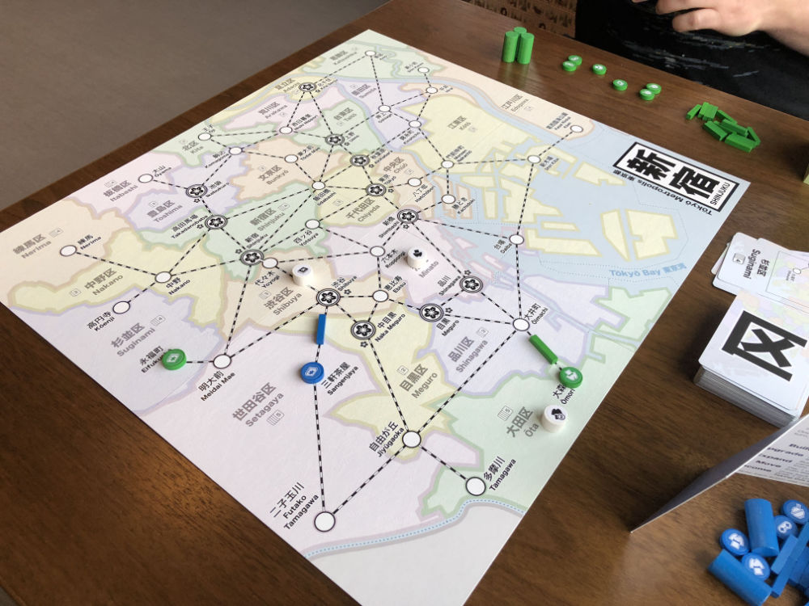 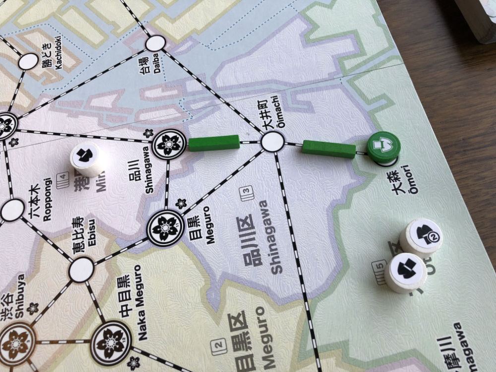 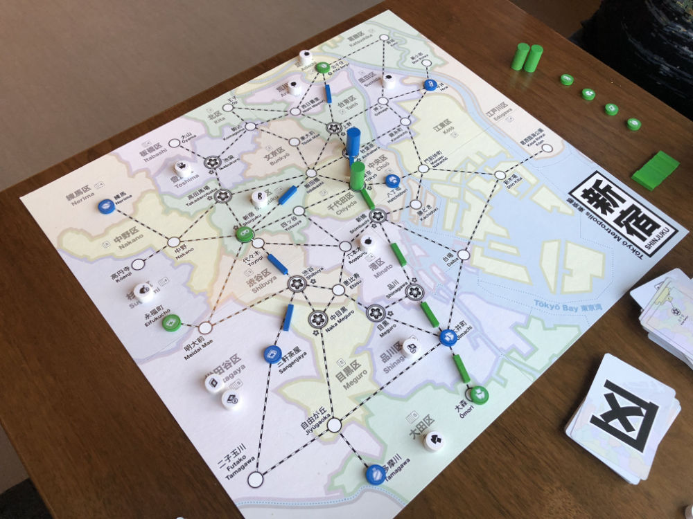 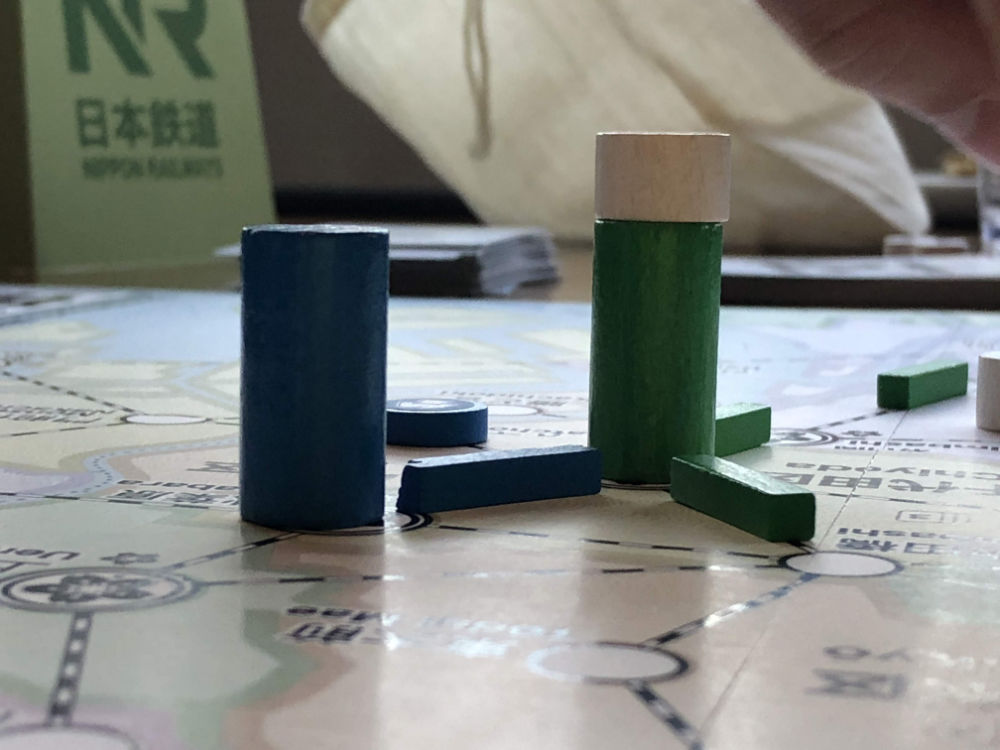 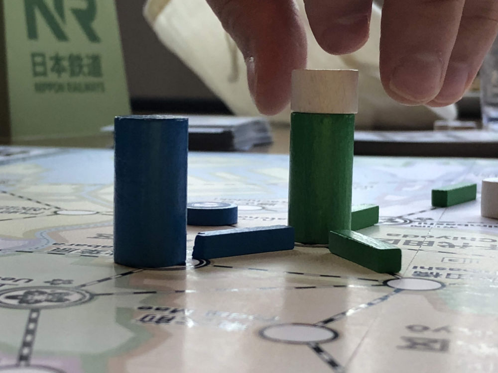  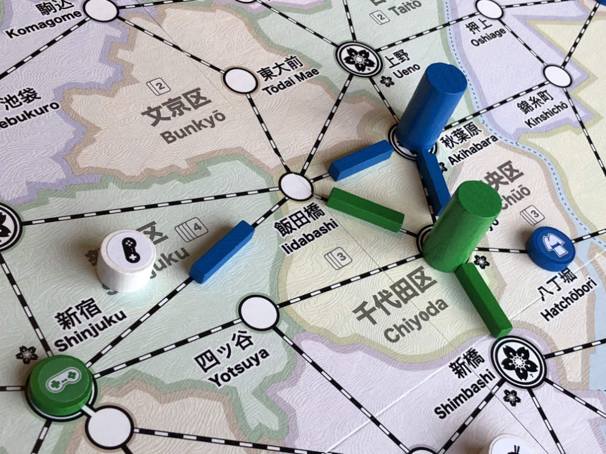 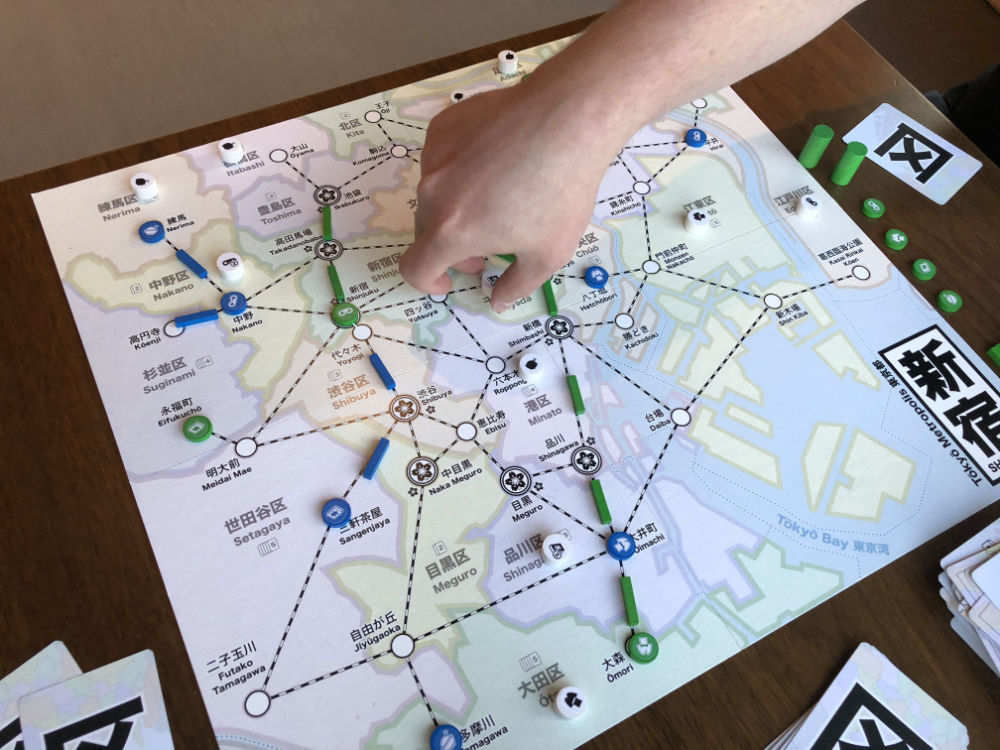 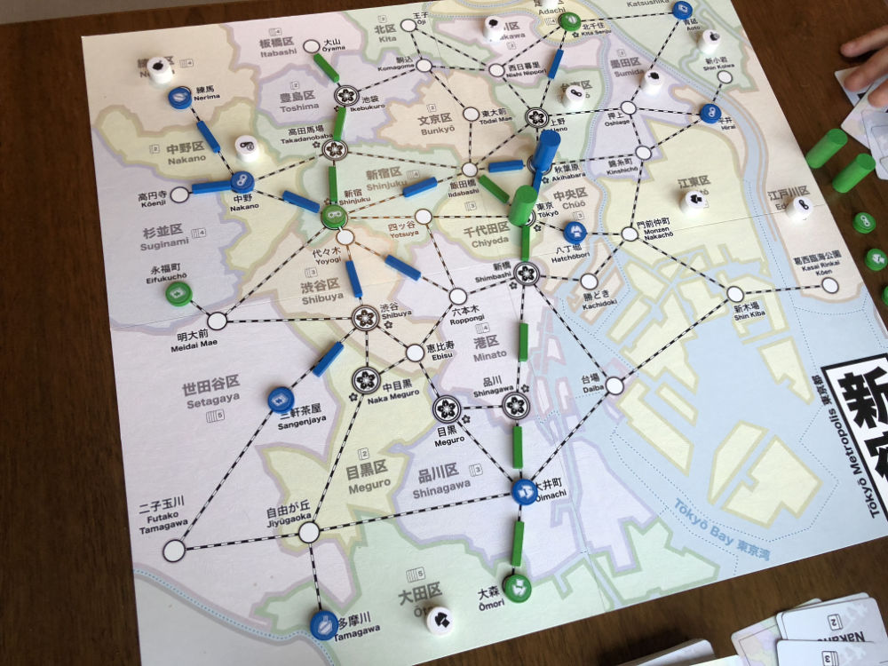 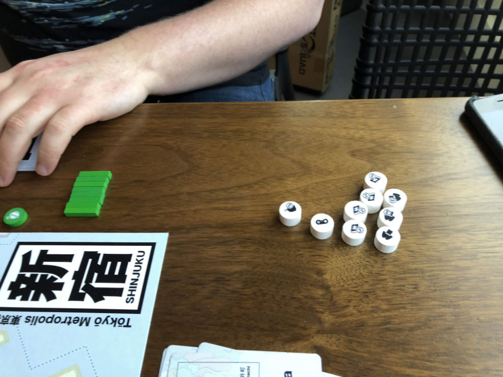 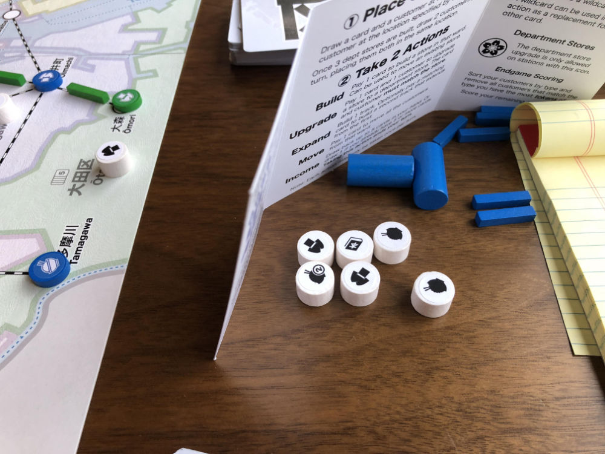 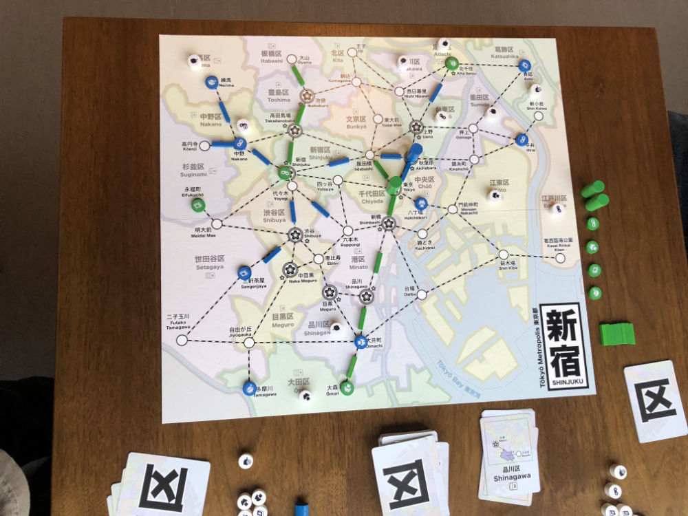 

Testing:

* During Move, customers must cross at least one rail
* Score: 1 pt / customer
* During Final round, no need to spend cards for actions

## Comments

Stopped game with 24 customers remaining

A: Re: Must move across rail

* frustrating thematically
	* why not just walk
	* why not just visit store
* can't take a single customer
	* but you can make groups with drop anywhere
* worse situation if you  have a store in same location as customer
	* singles get stuck

Suggestion:

* Can match single customers
* Remaining customers must move along rail if they can

How to describe:

* Play move card to walk to station in ward
* match store there if possible
* remaining customers must move along track (if possible)

Extended Move:

* after move, can play card that matches end location
	* to pick up customers and move again
	* this allows to pick up customers along the way

Distributing points on customers

* How to make the customer choice more interesting
* instead of 1 & 2 (which is a big jump)
	* use 2,3,4,5
* different range for each customer type
	* food 1-3
	* video 3-5

Scoring

* set collection
	* 4-set, 3-set, 2-set
* scoring could be based on # of stores on board

* should players be allowed to make Moves that are worth 0 points?
	* why not? useful for grouping, but it's expensive

Must move across at least one rail

* Prevents turtle moves like Ota just taking 1 customer and dropping rest in same spot.
Here they would need to move 1 of the customers to Shinagawa or Minato.
	* 
* Single customers can be stuck until another customer joins them
	* 
	* Here the Electronics store is stuck even though every store can satisfy

## Suggestions/Actions

Todo:

* Allow remaining customers to be dropped anywhere
* Require Move to use track
* Put customer paid for dept store back in bag
