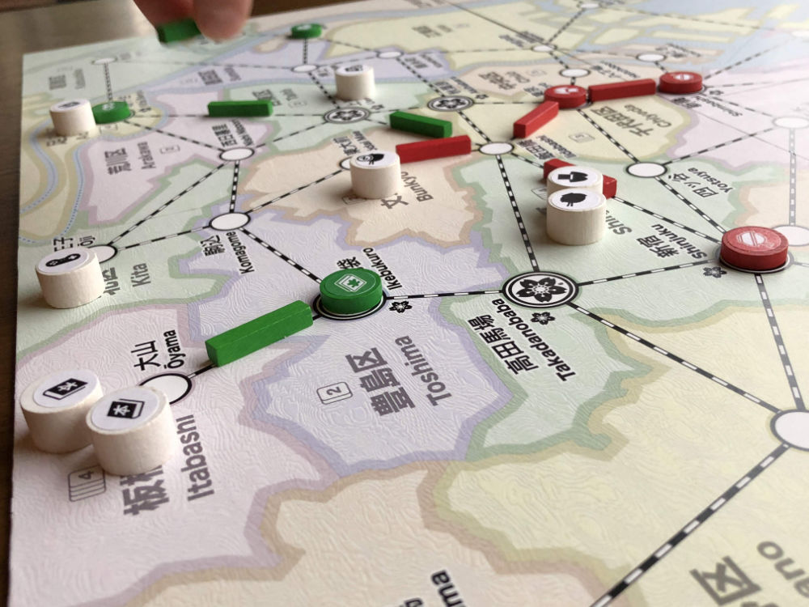

# Playtest #56

Mon 9 Dec 2019

Participants: Adam B, Gary K

                      

Testing:

* Scoring: set collection
	* 4-cust = +6 pts
	* 3-cust = +3 pts
	* 2-cust = +1 pts
* During Final round, no need to spend cards for actions
* May continue past last matched customer during Move
* Pay card for extended Move
* Put dept store customer payment back in bag

## Comments

* No majority bonus for customers

* can you move without satisfying a customer?
	* move without points
	* useful for herding
		* customer that isn't accessible to current player can be moved

Feel good

* draw other players wild
* deprive them of wildcard or a customer placement there

Scoring multi sets

* means I care about more customer types
* more are relevant to my sets
* cf. focus on avoiding type that you need to throw away

We never did a double move

Score:

Adam: 54 = 30 + 4x6 + 0x3 + 0x1
Gary: 75 = 37 + 5x6 + 2x3 + 2x1

High score without building dept store

Thoughts on upgrading dept stores:

* can upgrade when you Move and give a customer to that store.
	* pay card during Move
* only on your move - not when other players give cust to that store
* enables strategy: move customers to prevent upgrade

New action: pay card to move customer to neighboring ward

## Suggestions/Actions

Todo:

* Allow remaining customers to be dropped anywhere
* Require Move to use track
* Put customer paid for dept store back in bag
* Add more customers