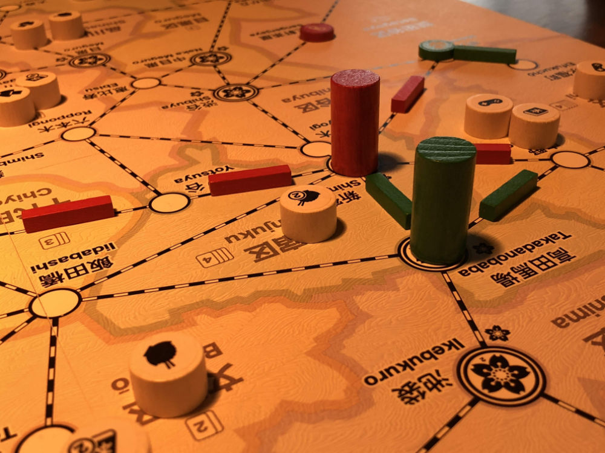

# Playtest #57

Fri 13 Dec 2019

Participants: Adam B, Gary K

         

Testing:

* double customers
	* 104 customers total
	* drawing 2 customer at a time at start
	* draw 4 once 3 dept stores build
* During Final round, no need to spend cards for actions
* Must use track during Move if possible
* Scoring: set collection
	* 4-cust = +3 pts
	* 3-cust = +2 pts
	* 2-cust = +1 pts
* May continue past last matched customer during Move
* Put dept store customer payment back in bag

## Comments

Stopped early

POS: Number of customers in bag felt good (lots!)

POS: Lots of customers early in game on board

NEG: Lots of card drawing - (shuffling)

NEG: customers don't clump immediately

Adam: Customer placement could just go to the top of discard pile

* to eliminate need to draw new card

NEG: too many good locations to eval and choose from

* which one to choose?
* trouble evaluating the entire board

NEG: drawing 4 cards for customers was tedious

## Suggestions/Actions

next:

* test placing customer at location on top of discard
