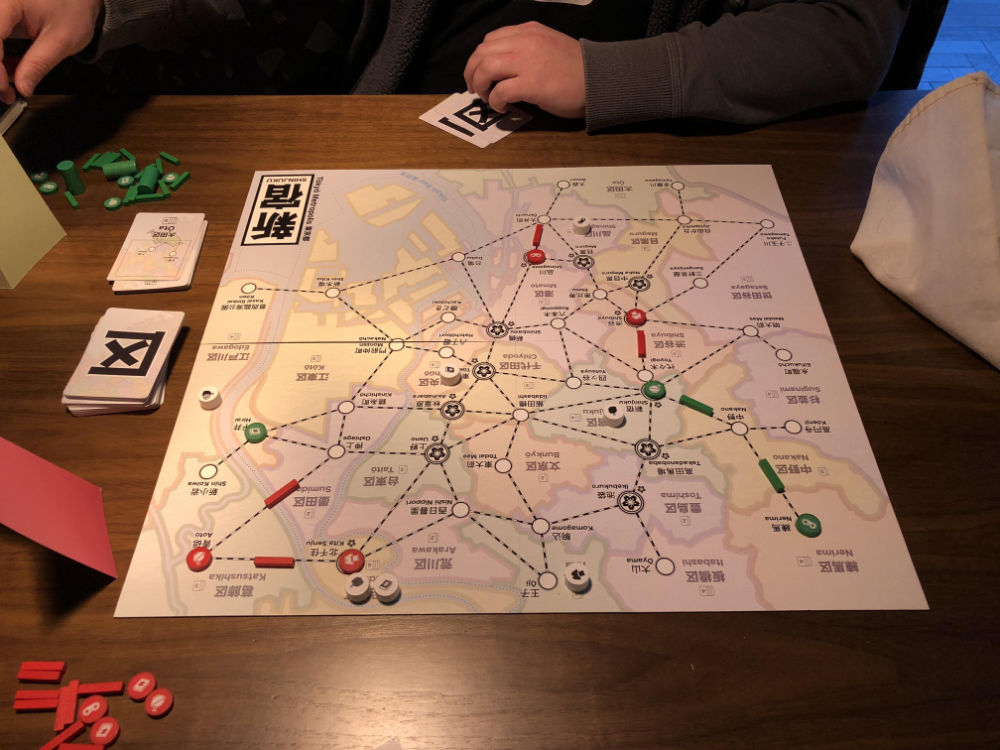
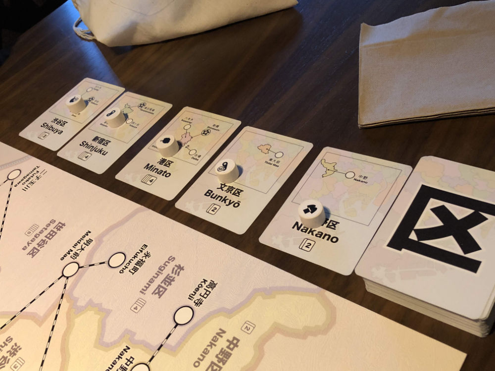

# Playtest #58

Fri 13 Dec 2019

Participants: Adam B, Gary K

          

Testing:

* same as last game +
* placing customer at location on top of discard pile

## Comments

* Need to start game with a card on the discard pile

* Track + Income feels worse
	* another customer is placed at the opponents location

* does this encourage more local building?
	* both our networks were very local and self contained

* clumping was weird in this game

* first few moves had fewer goals
	* customer already had someone's store on them

* ideal customer card draw is 1
	* 0 = bad
	* 2 = OK
	* >2 = tedious

* queue of customer draws on table
	* too much info?
* the player views the customer draw as a "gift" from the game
	* how can it feel fair

## Suggestions/Actions

next:

* queue of customers on table
