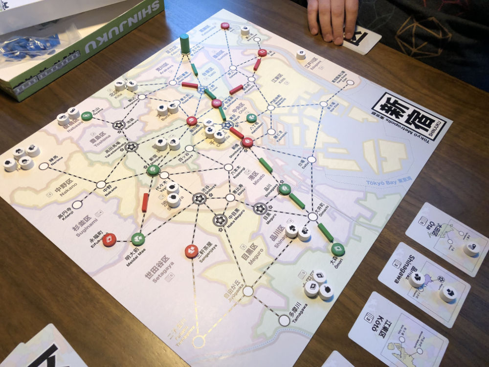

# Playtest #59

Mon 16 Dec 2019

Participants: Adam B, Gary K

               

Testing:

* sidebar of customers
	* 4 cards on conveyor belt
	* 5 customers drawn and placed on cards
		* customers clumped by type
		* e.g., all Food placed on same card
	* at start of turn,
		* player takes/places customers on next card
		* next card is drawn
		* new customers are drawn
			* equal to the number of customers just placed
			* so there are always the same number
* dept store upgrade payment goes onto sidebar
	* to increase the total number of customers in sidebar

## Comments

* customers placed on card in what order?
	* Food (if present) on first card
	* Clothing on next
	* Books on next
	* Video on next

* need to be clear on who should draw the customers
	* place at start or end of turn

* start of turn feels better for placement
	* but next player should draw next card and customers
	* allows player to take their turn
	* speeds game along

* should the player take the card used to place the customer?
	* currently it is discarded
	* if they take the card, it would be a small income
	* good card - is guaranteed to have a customer there
		* to build or to draw customers

* played with 52 customers
* faster customer draw made this a short test game
* too fast?
* start with only 2 customers at start of next game
	* 3 for 2p; 2 for 3p; 1 for 4p

The game plays faster now. Can it support 5 players?

* If we take the customer card into the players hand
	* instead of discarding
	* then hand size will need to be reduced to 4
	* or else 5 cards + 1 = 6 which is 2 wildcards.

Score:

* Adam: 36 = 23 + 4x3 + 0x2 + 1x1
* Gary: 37 = 27 + 3x4 + 0x2 + 1x1

## Suggestions/Actions

next:

* more customers with sidebar
