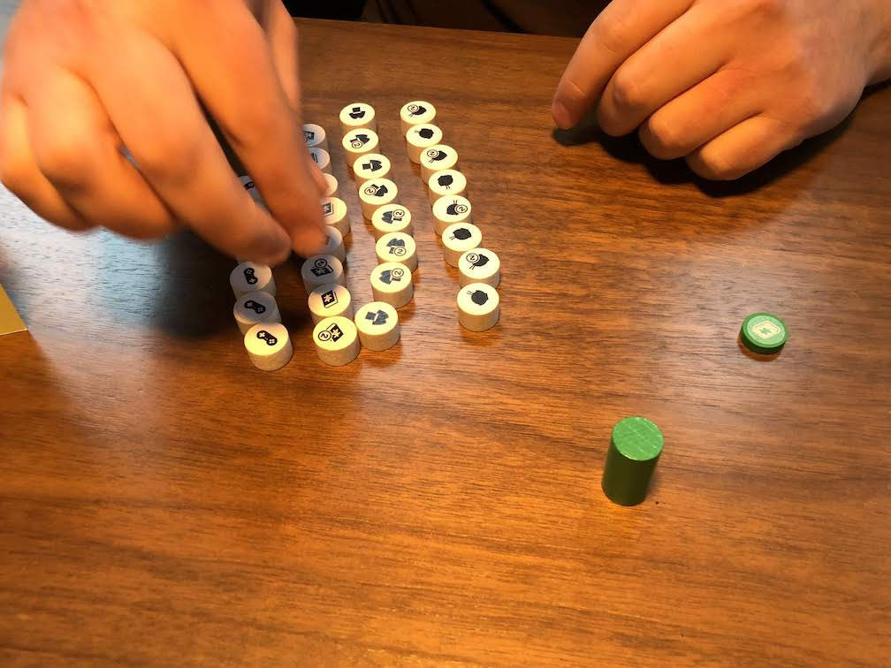

# Playtest #60

Tue 17 Dec 2019

Participants: Adam B, Gary K

              

Testing:

* 72 customers
	* 23 = 15/8 Food
	* 20 = 13/7 Clothing
	* 16 = 11/5 Books
	* 13 = 9/4 Electronics
* player takes card from sidebar when placing customer
* start with 2 customers in queue
* draw up to 4 cards in hand (changed from 5)
* dept store upgrade payment goes onto sidebar
	* to increase the total number of customers in sidebar
* scoring sets as a +3/+2/+1 bonus on top of the regular customer value

## Comments

The sort order for customers needs to be on the map/screen or somewhere for reference. Since this is used to add customers to the sidebar.

Only drawing up to 4 feels less satisfying than 5. But is that just because I'm used to having 5.

Game took 55 min til end.

Score:

|        | Adam |         | Gary |         |
| ------ | ---- | ------- | ---- | ------- |
| 4-sets |   6  | x3 = 18 |   7  | x3 = 21 |
| 3-sets |   2  | x2 =  4 |   0  | x2 =  0 |
| 2-sets |   0  | x1 =  0 |   1  | x1 =  1 |
| double |  13  | x2 = 26 |  10  | x2 = 20 |
| single |  17  | x1 = 17 |  20  | x1 = 20 |
| total  |      |      65 |      |      62 |

## Suggestions/Actions

next:

* test with 72 customers and sidebar
* work on appropriate number of customers to have in queue and how fast that should grow when dept stores are build
