# Playtest #61

Wed 18 Dec 2019

Participants: Adam B, Gary K

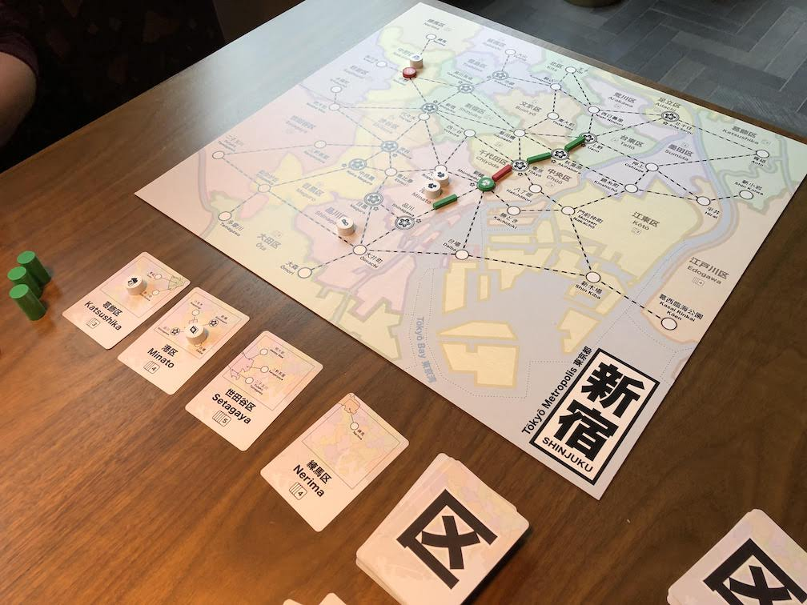 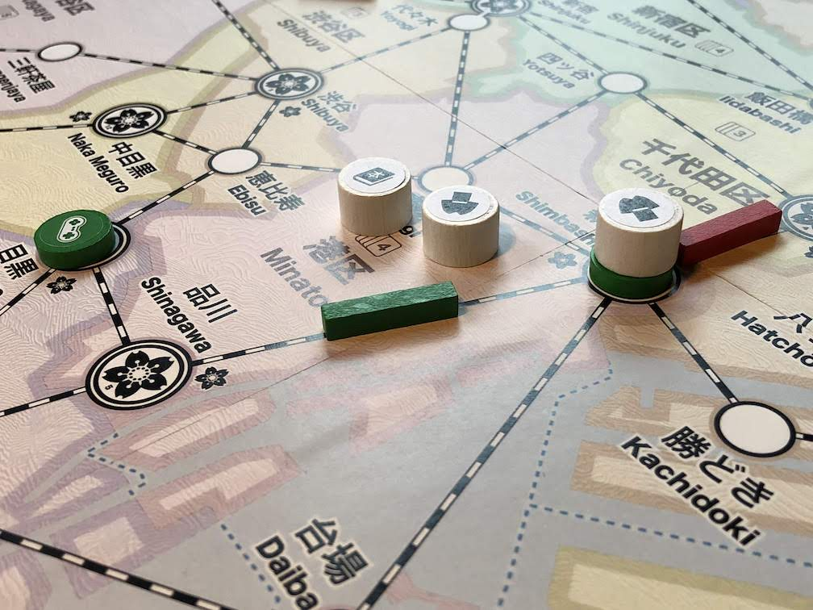 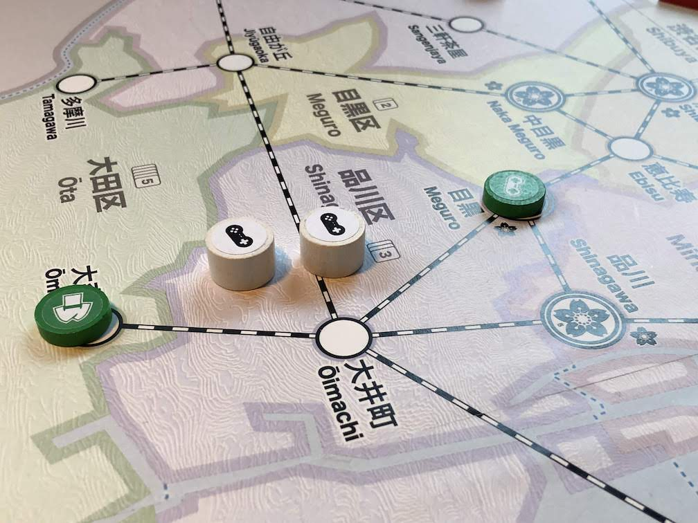 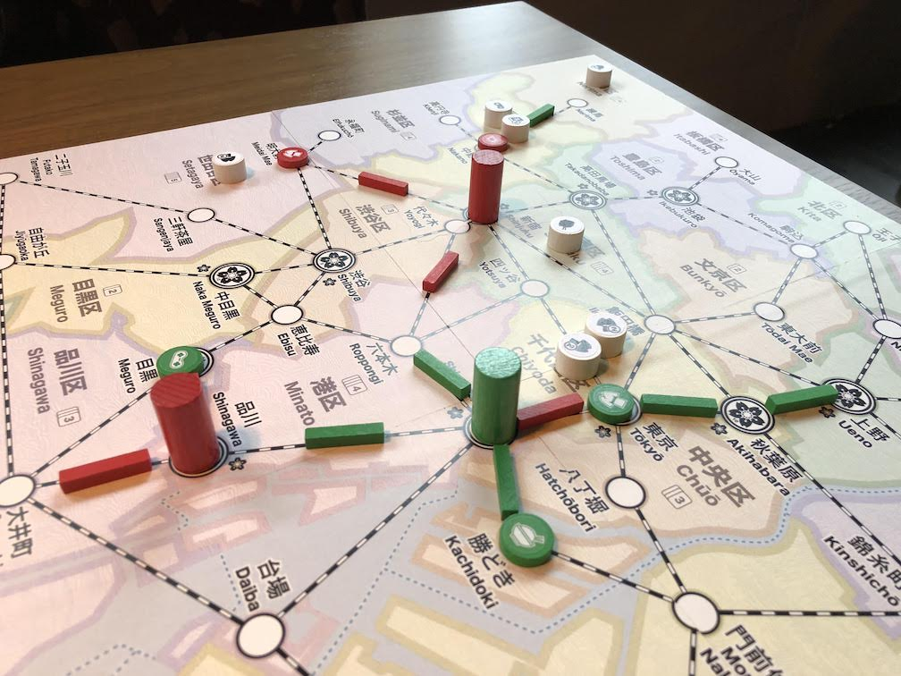 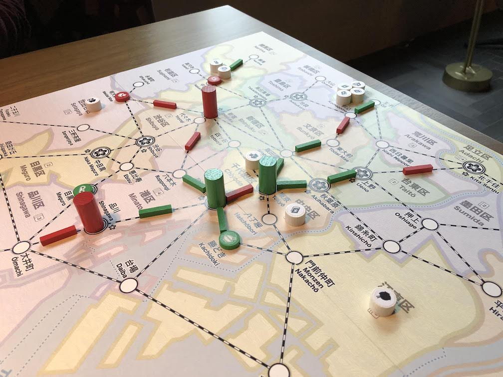 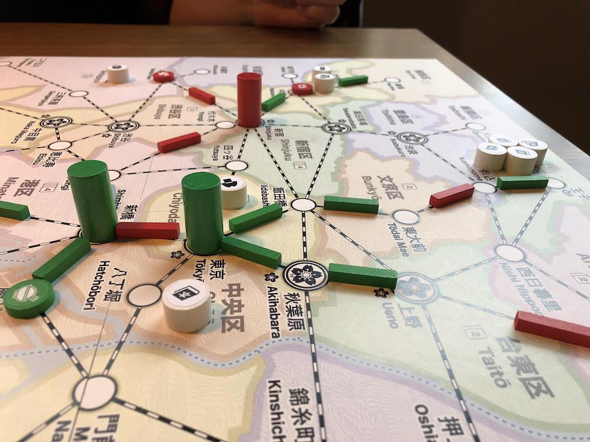 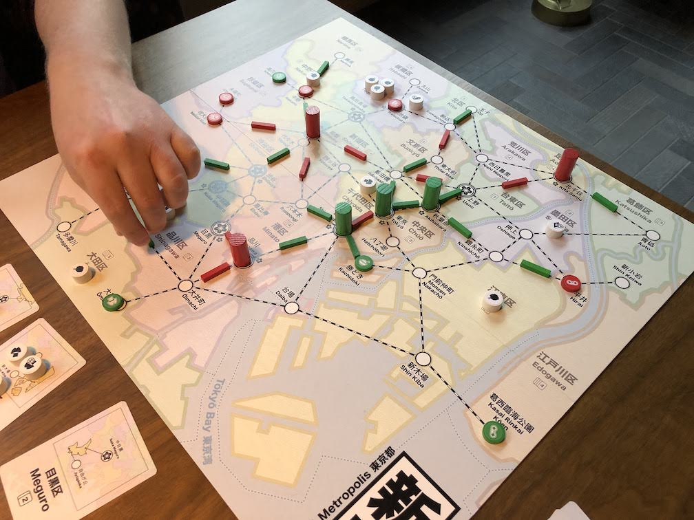 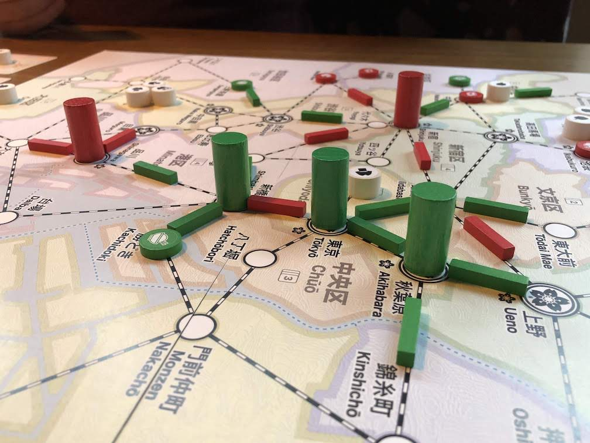 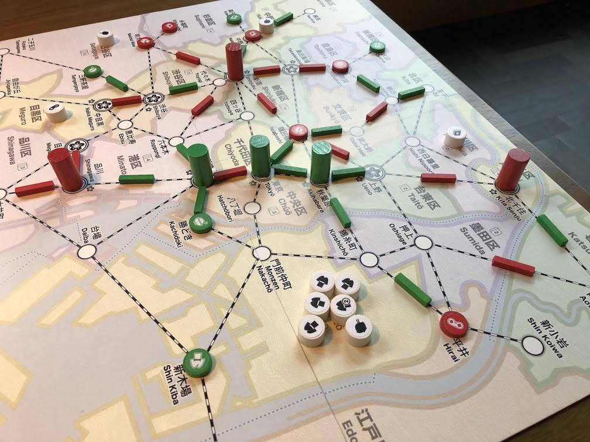 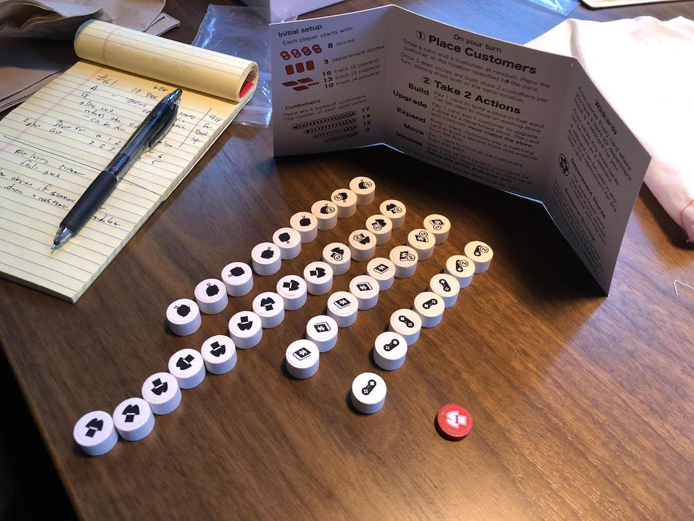 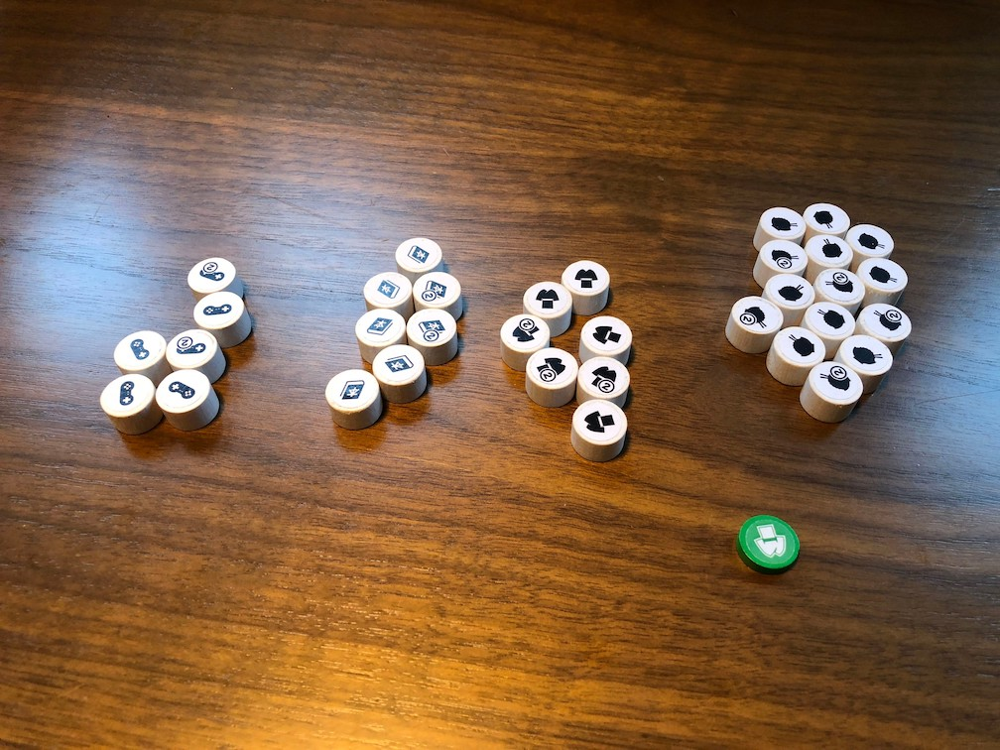 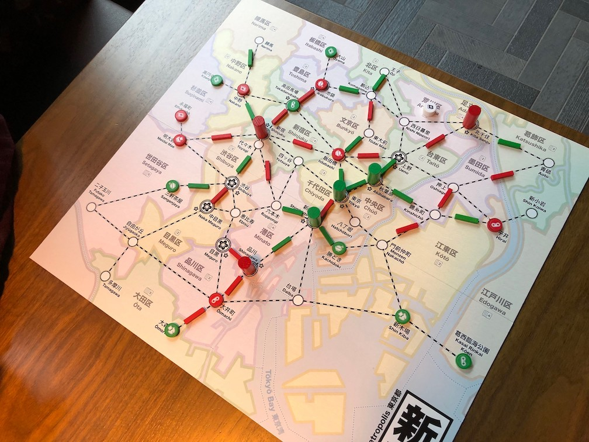 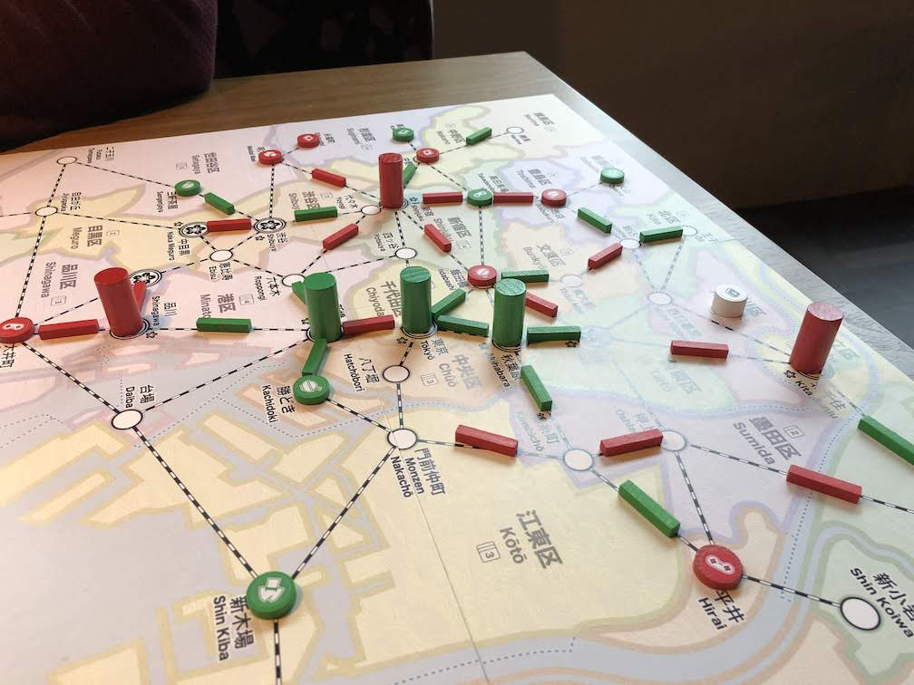 

Testing:

* Remove Upgrade action
	* Upgrade during match when that store gains a cuatomer
	* Player pays card but keeps customer
* gain 4 vp for each dept store
* customer queue is expanded based on number of dept stores:

For 2 player:

|        Dept Stores |  0  |  1  |  2  |  3  |  4  |  5  |  6  |
| ------------------ | --- | --- | --- | --- | --- | --- | --- |
| Customers in Queue |  2  |  2  |  3  |  3  |  4  |  4  |  5  |

## Comments

Not losing the customer feels good.

With the Customer sidebar, it is now fairly obvious if someone forgets to place a customer.

* Adam Design Patterh: Upkeep should benefit someone or be exciting

With dept store bonus, for most 2-player games both players will have the same bonus.

Score:

|        | Adam |         | Gary |         |
| ------ | ---- | ------- | ---- | ------- |
| depts  |   3  | x4 = 12 |   3  | x4 = 12 |
| 4-sets |   6  | x3 = 18 |   7  | x3 = 21 |
| 3-sets |   1  | x2 =  2 |   1  | x2 =  2 |
| 2-sets |   0  | x1 =  0 |   1  | x1 =  1 |
| double |  12  | x2 = 24 |  12  | x2 = 24 |
| single |  22  | x1 = 22 |  25  | x1 = 25 |
| total  |      |      -- |      |      -- |

## Suggestions/Actions

next:

* test again with Upgrade during Move
