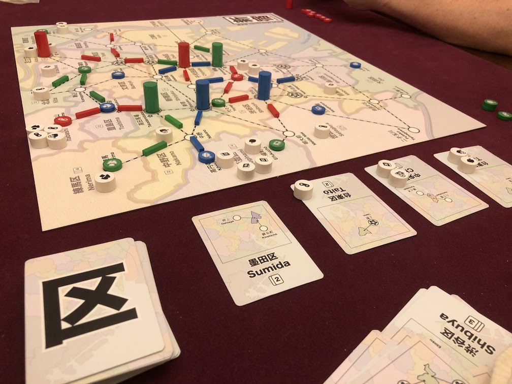

# Playtest #62

Thu 19 Dec 2019

Participants: Jeff B, Sverre R, Gary K

            

Testing:

* 3-player
* Remove Upgrade action
	* Upgrade during match when that store gains a cuatomer
	* Player pays card but keeps customer
* gain 4 vp for each dept store
* customer queue is expanded based on number of dept stores:

|    Dept Stores |  0  |  1  |  2  |  3  |  4  |  5  |  6  |  7  |  8  |
| -------------- | --- | --- | --- | --- | --- | --- | --- | --- | --- |
| 2-player Queue |  2  |  2  |  3  |  3  |  4  |  4  |  5  |  5  |  6  |
| 3-player Queue |  2  |  2  |  2  |  3  |  3  |  4  |  4  |  5  |  5  |
| 4-player Queue |  2  |  2  |  2  |  2  |  3  |  3  |  4  |  4  |  5  |

Played with 3-player queue size

## Comments

The ramp for 3-player felt too slow. When we hit 4 dept stores, we changed to:

|    Dept Stores |  0  |  1  |  2  |  3  |  4  |  5  |  6  |  7  |  8  |
| -------------- | --- | --- | --- | --- | --- | --- | --- | --- | --- |
| 3-player Queue |  2  |  2  |  2  |  3  |  4  |  4  |  5  |  5  |  6  |

Adjusting customer ramp:

* move to 3 customers one step earlier?
* move faster: # customers in queue = # of dept stores?

Note: when describing the rule that customers must cross track if possible

* Can it be phrased as "can't drop back into the same spot"
* because that rule would affect some locations
* e.g., Chiyoda, where you can pick up in one station, follow track and drop back in Chiyoda.
* Is that OK? Or is it easier to describe this as "you must cross track"
* "must cross track" feels more thematic

Score:

|        | Jeff |         | Sverre |         | Gary |         |
| ------ | ---- | ------- | ------ | ------- | ---- | ------- |
| depts  |   2  | x4 =  8 |     2  | x4 =  8 |   2  | x4 =  8 |
| 4-sets |   4  | x3 = 12 |     1  | x3 =  3 |   5  | x3 = 15 |
| 3-sets |   0  | x2 =  0 |     7  | x2 = 14 |   1  | x2 =  1 |
| 2-sets |   2  | x1 =  2 |     0  | x1 =  0 |   0  | x1 =  0 |
| double |  10  | x2 = 20 |     5  | x2 = 10 |   9  | x2 = 18 |
| single |  11  | x1 = 11 |    18  | x1 = 18 |  15  | x1 = 15 |
| total  |      |      53 |        |      53 |      |      56 |

Jeff:

* "No useful feedback" "awesome"
* strategic; not super deep
* had agency. knew what was going on
* liked not allowing "turtle" moves
	* turtle = pickup; take single customer; drop in same location
* no feel-bad moments in game
	* no times when I was stuck with no useful cards

Sverre:

* always had cards
* game kept moving
* would be nice if the ramp went faster

## Suggestions/Actions

next:

* test again with Upgrade during Move
