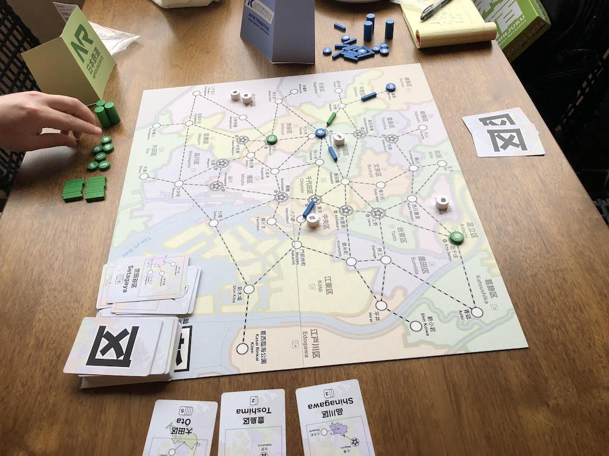
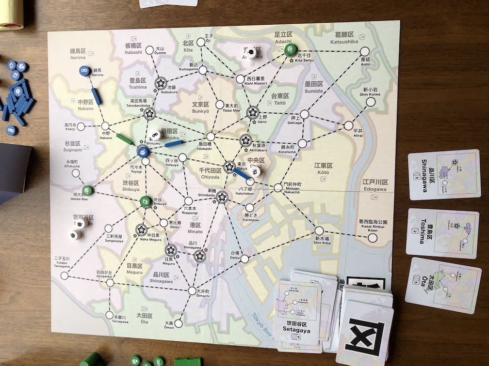
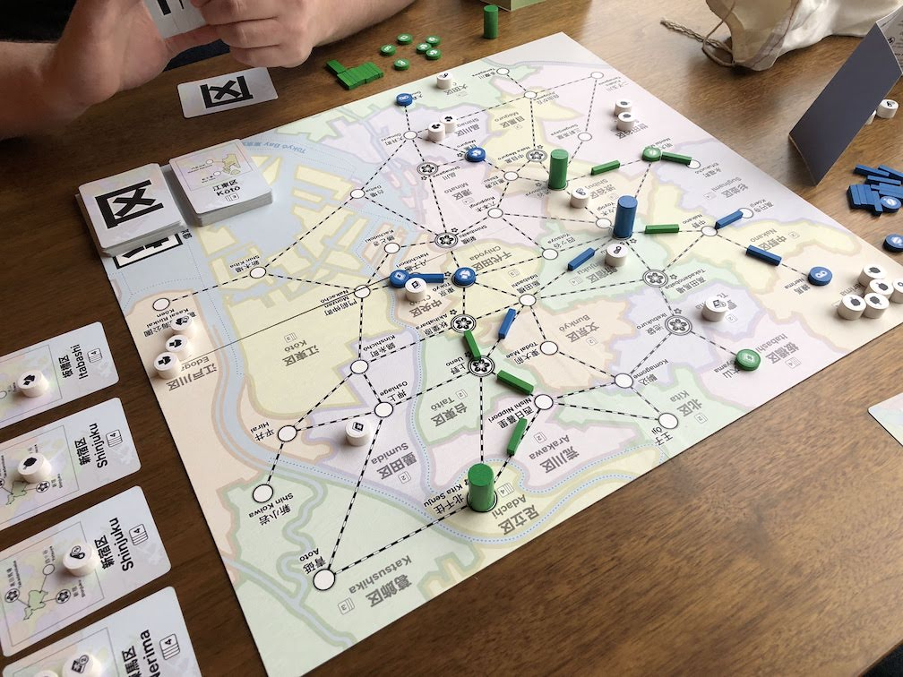
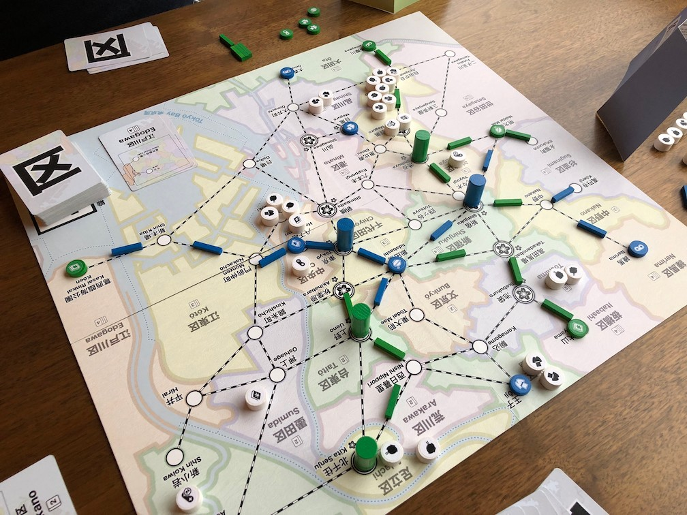
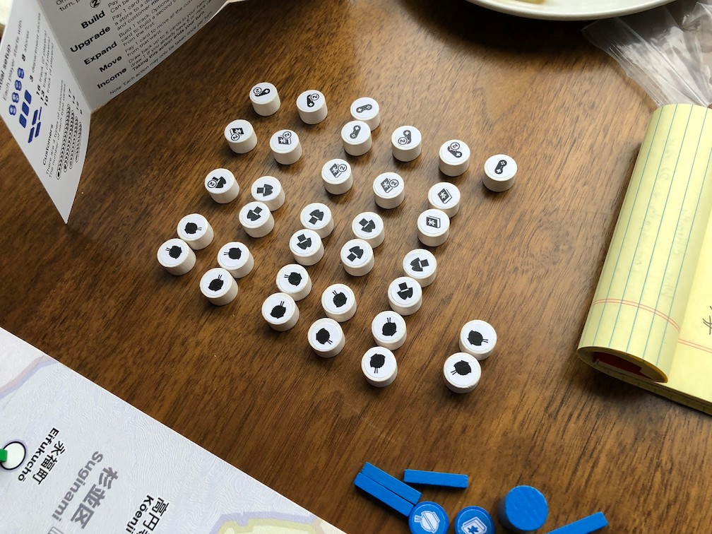
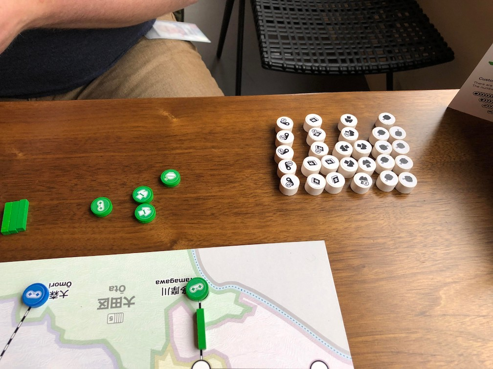
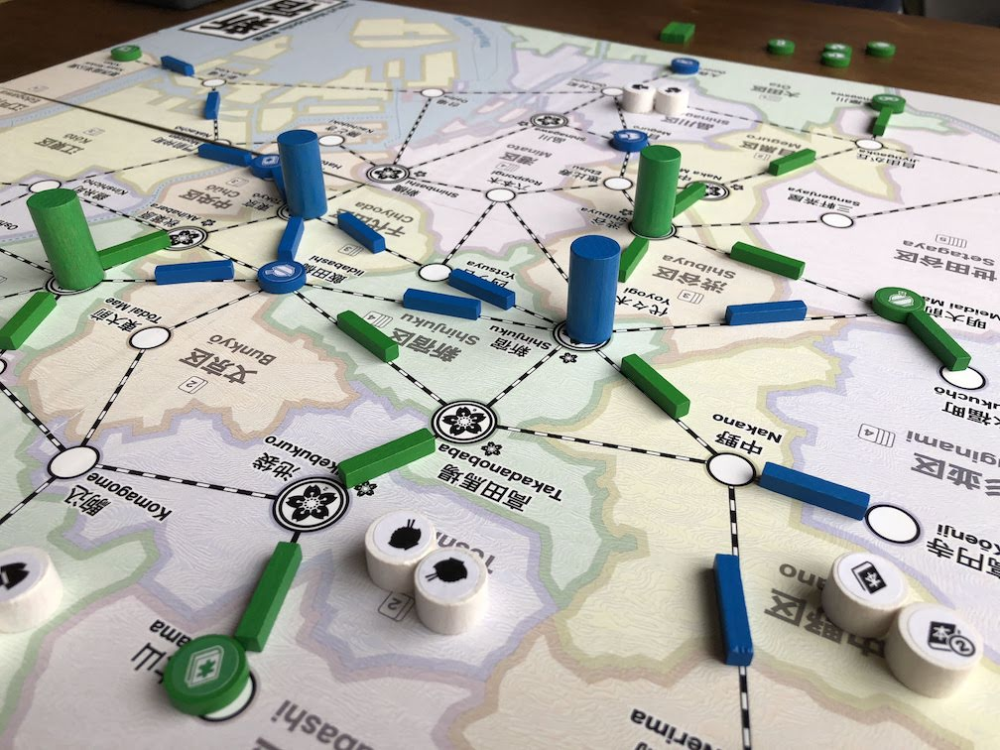

# Playtest #64

Mon 30 Dec 2019

Participants: Adam B, Gary K

       

## Testing

* separate action for Move and Upgrade
* 72 customers with new distribution:
	* Food: 23 singles, 0 doubles
	* Clothing: 17 singles, 3 doubles
	* Books: 9 singles, 7 doubles
	* Electronics: 3 singles 10 doubles
* dept store bonus:
	* for 2-player game:
	* 20 for 1st, 16 for 2nd, 12, 8, 4, 0 for 6th and later
* sidebar: start with 2 customers, add one per dept store

## Comments

Didn't have tokens to track dept store bonus, but wrote down values:

| Bonus |  20 |  16 |  12 |  8  |  4  |   0 |
| ----- | --- | --- | --- | --- | --- | --- |
|       |  G  |  A  |  A  |  G  |  A  |     |

Deot

Score:

* Adam : 123 = 91 + 32 dept store bonus
* Gary : 132 = 104 + 28 dept store bonus

Is the track limit needed the time/action limit is so tight?

## Suggestions/Actions

next:

* remove track limit to see if it is still necessary
* experiment with dept store bonus
	* give a set collection bonus instead of direct VP bonus
	* re-inforce what is already in the game
* Add one more double-customer per type
	* That way every type has at least one double-customer
	* Electronics has 2 singles (symmetry with Food)
	* 8/8 split for Books
