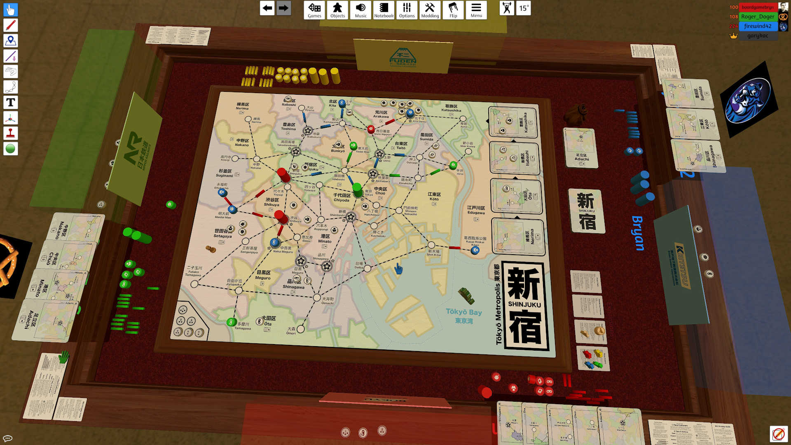
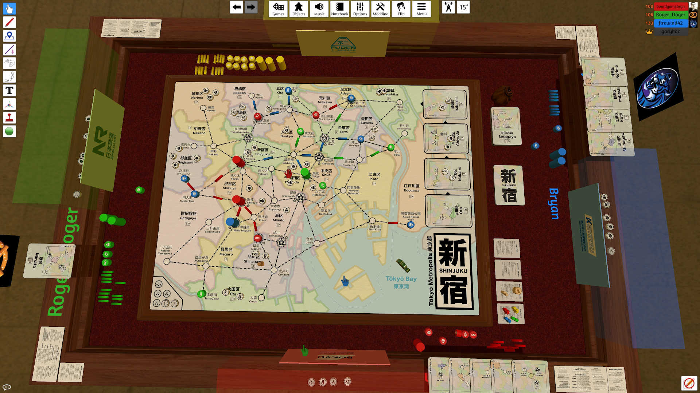
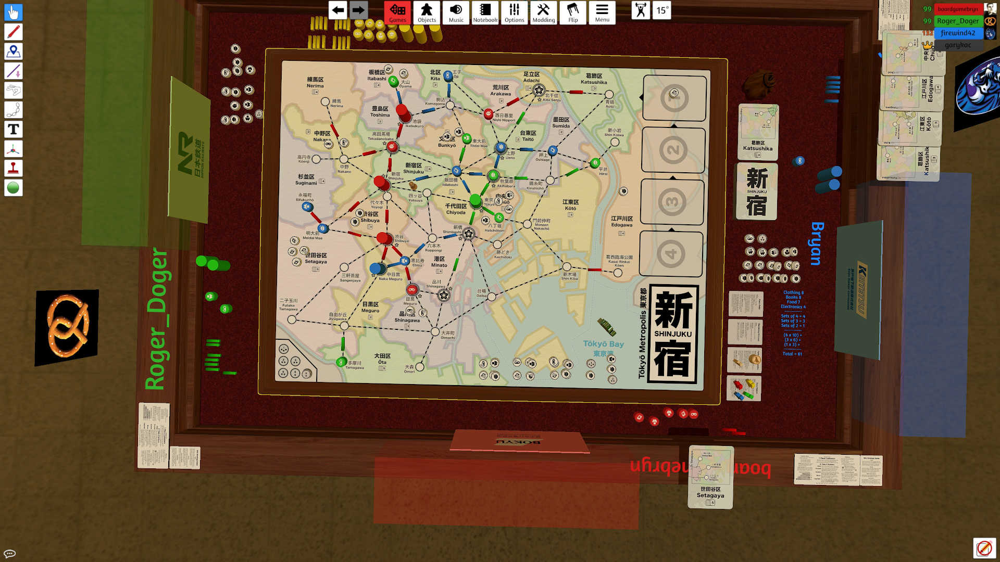

# Playtest #69

Wed 10 Jun 2020

Participants: Bryn S, Roger M, Bryan K

     

## Testing

* Incentives for building Department Stores
	* Is the building bonus sufficient to motivate players to build department stores quickly?
* Does including mods in the intro game distract players from the core game?
	* Including Princess and Kaiju mod
* Rules: v2 r6
	* with change so that Dept Store bonus can be any customer type (don't need to be select a single customer type for each token)

## Comments

Game teach required ~ 25 minutes

Two languages is distracting - Japanese dominates the labels

Enjoying the Princess mod

BK: The base game has enough complexity that doesn't feel the need to think about the mods (Princess)

BS: Dept bonus could have been 0 stars - there was still enough motivation to get them out.

### Score

|        | BrynS (R)  | RogerM (G) | BryanK (B) |
| ------ | ---------- | ---------- | ---------- |
| 4-sets | 8 x10 = 80 | 2 x10 = 20 | 4 x10 = 40 |
| 3-sets |          0 | 3  x6 = 18 | 3  x6 = 18 |
| 2-sets |          0 |          0 | 1  x3 =  3 |
| single |          0 | 2  x1 =  2 |          0 |
| total  |         80 |         41 |         61 |

### End of game comments

#### Roger

* Not used to heavy games
* Didn't watch the queue (of upcoming customers) that much
* enjoyed the game
* princess - relied on big time
* after building the first dept sore
	* liked the incentive - felt good
* struggled with the Japanese
	* it overpowers the game
	* fine once you're familiar with it
* otherwise a lot of fun
* To aid in scoring, perhaps a player aid that made them easy to line up and count

#### Bryan

* cool game
* favorite part:
	* doesn't usuallly like games with strong themes
	* but likes the theme here because he likes japanees culure
* like route building
* had trouble with strategy
	* even at end of game
	* doesn't feel like he quite has a grasp of the best way to play
		* Question: is that pos, neg or neutral comment?
			* neutral, i suppose
			* but would be a problem if it was a game I had no connection to
			* but since the connection to theme was good
	* liked mechanics
	* liked it enough to play again
* similar to roger
	* didn't look at queue enough
	* overall strategy didn't quite click into place
	* got a sense of customers, but didn't look ahead to spend cards
* set collection was interesting
	* but didn't pay atention to it that much
	* so didn't score as high
* didn't look at expansions
* I think i would like it more with repeated play

#### Bryn

* Background:
	* I've been in industry for 10 years
	* primarily in role of professional developer
	* never seen a prototype this refined
	* smoothest playthrough of any proto
* what I want to see:
	* i could jump in easily at the start.
	* ignored kaiju because it wasn't strategicsally control with it.
		* never saw an opportunity to use it
* middle of the game became sluggish
	* just collecting sets
	* my brain for last 2/3rd of game was just: how do I get things I don't have
* I wanted something more about middle of the gmame
	* there's already a lot
	* but wanted opportunites to build outside of sets
* with enough playthroughts
	* it would become stale like chess
* would love to see something about the game that ramps the puzzle
* right now the game becomes easier as the game progresses

* beginning puzzliness is enjoyable
* around middle began to lose that
	* just looking for the next set

* I woudm't mind seeing something core to the game that ramps the puzzle all the way to end

Roger:

* what if customers "stuck" to the dept store
	* leave it on top to change the game as it progressed
	* Problem: dept stores are currently wild (all customers), so this might reduce their value. could be used to "attack" other players dept stores.

Bryn:

* Speaking about Brass
	* Brass is what he initially thought when he saw it
* What keeps the puzzle in Brass interesting:
	* is when the rules change
	* the requirements change
	* a different resouce - a new dyanmic
* Make building more challenging
	* midway through the game

## Suggestions/Actions

* UX fixes:
	* Adjust snap point for Ebisu - too close to some track [Issue 53](https://github.com/garykac/shinjuku/issues/53)
	* Shift Blue and Green hidden regions over a bit since they hide one of the cards on the hand (since the card overlaps with the hidden region) [Issue 54](https://github.com/garykac/shinjuku/issues/54)
		* Not a gameplay problem, but the players appear to be missing a card which can be a distraction
	* Investigate changing outer ring around customers/stores so that each type is different. This can make them more easily distinguished from a distance. [Issue 55](https://github.com/garykac/shinjuku/issues/55)
	* Investigate putting marking on side of customers (like dots for double-customers) so they can be distinguished when stacked (like poker chips). [Issue 55](https://github.com/garykac/shinjuku/issues/55)
	* Consider adding a note on the board that the number of customers in the queue is always equal to # of dept stores + 2. [Issue 56](https://github.com/garykac/shinjuku/issues/56)

* Rules clarifications:
	* Can start a Move action from an empty station [Issue 57](https://github.com/garykac/shinjuku/issues/57)
		* as long as there is track leading out
	* You cannot move/relocate a department store [Issue 59](https://github.com/garykac/shinjuku/issues/59)
	* Edge case with needing to move across track when there are multiple customers: [Issue 60](https://github.com/garykac/shinjuku/issues/60)
		* The segment connecting Shinjuku and Yoyogi counts as track
	* With regards to playing a card for double-track: [Issue 58](https://github.com/garykac/shinjuku/issues/58)
		* Feels good to play card and then do a thing. Phrase the rule that way.

* Is there a better order of operation for placing customers from the queue/refreshing to make it easier to track the number of customers that must be drawn? [Issue 56](https://github.com/garykac/shinjuku/issues/56)
	* Draw all the customers first? But the order in which they are drawn sometimes affects where they are placed.

* Investigate making a player aid to assist with final scoring. [Issue 61](https://github.com/garykac/shinjuku/issues/61)
* Can the department store perform double-duty and be more interesting?
* Can the puzzle ramp up as the game progresses?
