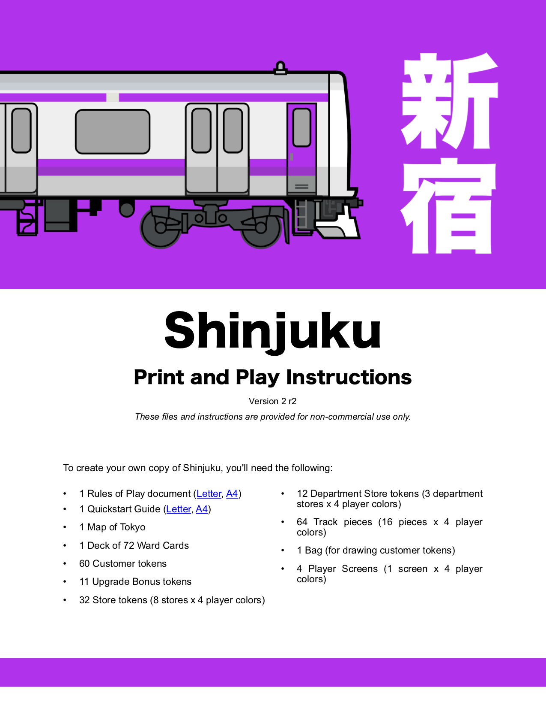

# Shinjuku - Print-n-Play

_These files and instructions are provided for non-commercial use._

| |
| --- |
|  |
| 
PnP Instructions (<a href="https://garykac.github.io/shinjuku/pnp/shinjuku-pnp/shinjuku-pnp-instr.pdf">Letter</a>, <a href="https://garykac.github.io/shinjuku/pnp/shinjuku-pnp/shinjuku-pnp-instr-a4.pdf">A4</a>)
 |

In addition to the PnP instructions (above), you'll need the following files to create the components:

* 1 Rules of Play document - ([Letter](https://garykac.github.io/shinjuku/docs/shinjuku_rules.pdf), [A4](https://garykac.github.io/shinjuku/docs/shinjuku_rules_a4.pdf))

* 1 Quickstart Guide - ([Letter](https://garykac.github.io/shinjuku/docs/shinjuku_quickstart.pdf), [A4](https://garykac.github.io/shinjuku/docs/shinjuku_quickstart_a4.pdf))

* Shinjuku Map - [Single large image](https://garykac.github.io/shinjuku/pnp/shinjuku-pnp/map-color.jpg)

* Shinjuku Cards - 8 pages, 9 cards per page - ([Letter](https://garykac.github.io/shinjuku/pnp/shinjuku-pnp/cards-color.pdf), [A4](https://garykac.github.io/shinjuku/pnp/shinjuku-pnp/cards-color-a4.pdf))

* Player Screens - 4 double-sided pages - ([Letter](https://garykac.github.io/shinjuku/pnp/shinjuku-pnp/screens.pdf), [A4](https://garykac.github.io/shinjuku/pnp/shinjuku-pnp/screens-a4.pdf))

* Labels (stickers) for customers/stores - ([Letter](https://garykac.github.io/shinjuku/pnp/shinjuku-pnp/stickers.pdf), [A4](https://garykac.github.io/shinjuku/pnp/shinjuku-pnp/stickers-a4.pdf))

